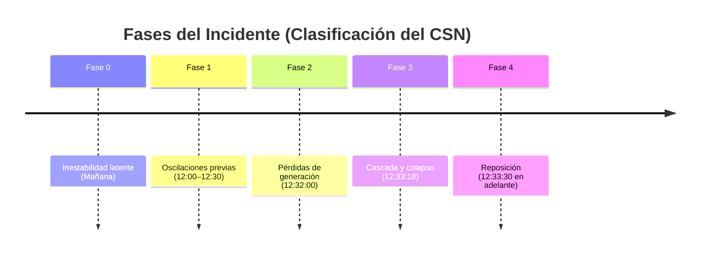

# Volcado de Componentes Visuales y Tablas

Este documento recopila todos los elementos visuales, tablas y simuladores del TFG para su auditoría con Claude.


## Capítulo: 01-introduccion.mdx

### _ieee39_secuencia.png) _Figura 1. Replicación de la secuencia del colapso (interacción OA/AA). Fuente: Albustami et al., 2025._

**Tipo:** Imagen Estática / Gráfica

**Párrafo Anterior:**
> Visión del gestor europeo (ENTSO-E). El informe factual de ENTSO-E adopta una perspectiva de área síncrona continental: analiza la propagación de oscilaciones inter-área y cuestiona la suficiencia del Criterio N−1 frente a fenómenos dinámicos ultrarrápidos propios de sistemas dominados por electróni...

**Código:**
```jsx
 _Figura 1. Replicación de la secuencia del colapso (interacción OA/AA). Fuente: Albustami et al., 2025._
```

**Párrafo Posterior:**
> El alcance del trabajo se articula sobre el contraste de estas tres narrativas con los _Network Codes_ europeos —en particular el Reglamento RfG— y con los principios modernos de estabilidad de tensión en sistemas dominados por inversores, con el propósito de identificar lecciones estructurales, lim...

---

### _grid_evolution.png) _Figura 2. Metamorfosis electromecánica del sistema de potencia (desplazamiento IBR). El reemplazo de grandes masas rotatorias reduce drásticamente la inercia total del sistema. Fuente: FutuRed, 2024._

**Tipo:** Imagen Estática / Gráfica

**Párrafo Anterior:**
> La transición energética ha alterado de forma profunda la dinámica del sistema peninsular. La sustitución acelerada de centrales síncronas por IBR reduce las masas rotatorias acopladas a la red y, con ellas, dos parámetros críticos de forma simultánea: la inercia del sistema (*H*) —que cayó a valore...

**Código:**
```jsx
 _Figura 2. Metamorfosis electromecánica del sistema de potencia (desplazamiento IBR). El reemplazo de grandes masas rotatorias reduce drásticamente la inercia total del sistema. Fuente: FutuRed, 2024._
```

**Párrafo Posterior:**
> La mañana del incidente, el sistema operaba con una elevada penetración de generación renovable no síncrona (cuya estructura en detalle se describe en el apartado de Contexto Técnico) en condiciones de demanda valle. Para equilibrar la generación, REE desacopló la práctica totalidad de los grupos té...

---

### _sensors_europe.png) _Figura 3. Localización topológica de las PMU en el sistema síncrono europeo. La densidad de cobertura fue determinante para la verificación independiente de las oscilaciones inter-área. Fuente: NREL._

**Tipo:** Imagen Estática / Gráfica

**Párrafo Anterior:**
> 3. Validación técnica cruzada. Cotejo de las secuencias cronológicas con el análisis independiente del NREL sobre oscilaciones inter-área, obtenido a partir de registros de Unidades de Medición Fasorial (PMU) de cobertura continental —datos cuya independencia institucional permite arbitrar entre ver...

**Código:**
```jsx
 _Figura 3. Localización topológica de las PMU en el sistema síncrono europeo. La densidad de cobertura fue determinante para la verificación independiente de las oscilaciones inter-área. Fuente: NREL._
```

**Párrafo Posterior:**
> Los modelos de lenguaje de gran escala se han empleado como herramienta de asistencia documental —clasificación, síntesis y extracción de datos críticos— dado el volumen excepcional de documentación técnica generada tras el incidente. Su aplicación se ha circunscrito estrictamente a la organización ...

---

## Capítulo: 02-contexto.mdx

### GlitchTitleContexto

**Tipo:** Componente Interactivo (GlitchTitleContexto)

**Párrafo Anterior:**
> --- sidebar_position: 2 hide_title: true title: "Contexto Técnico" --- import GlitchTitle from "@site/src/components/GlitchTitle"; import EnergyTransitionStreamgraph from "@site/src/components/EnergyTransitionStreamgraph"; import MixGeneracion from "@site/src/components/MixGeneracion"; import Collap...

**Código:**
```jsx
<GlitchTitle>Contexto Técnico</GlitchTitle>



## Evolución del parque generador: de la generación síncrona al mix dominado por IBR

A continuación, los datos en vivo de la red peninsular español
```

**Párrafo Posterior:**
> ```mermaid timeline title Fases del Incidente (Clasificación del CSN) Fase 0 : Inestabilidad latente (Mañana) Fase 1 : Oscilaciones previas (12:00–12:30) Fase 2 : Pérdidas de generación (12:32:00) Fase 3 : Cascada y colapso (12:33:18) Fase 4 : Reposición (12:33:30 en adelante) ```...

---

### _instalada_2025.png) _Figura 4. Capacidad de generación instalada a 31 enero 2025. Fuente: NREL / Red Eléctrica._

**Tipo:** Imagen Estática / Gráfica

**Párrafo Anterior:**
> En el primer cuatrimestre de 2025, el sistema peninsular consolidó este escenario superando los 100 GW de capacidad renovable instalada. A enero de 2025, casi el 66 % de la capacidad total procedía de fuentes descarbonizadas, con energía eólica y solar fotovoltaica en paridad técnica (24,9 % cada un...

**Código:**
```jsx
 _Figura 4. Capacidad de generación instalada a 31 enero 2025. Fuente: NREL / Red Eléctrica._
```

**Párrafo Posterior:**
> Como contrapartida, la generación síncrona convencional ha sido progresivamente desplazada: el carbón ocupa un papel residual (1,6 %) de la capacidad instalada, el nuclear (5,5 %) afronta un calendario de cierre progresivo, y los más de 26 GW de ciclo combinado de gas (*20,4 %*) operan con factores ...

---

### SwingEquationSimulator

**Tipo:** Componente Interactivo (SwingEquationSimulator)

**Párrafo Anterior:**
> :::tip Simulador interactivo — Ecuación de Oscilación Explora cómo varía la RoCoF al modificar la constante de inercia *H* del sistema. [**→ Abrir simulador en la Galería de Gráficas Interactivas**](./galeria-graficas.mdx#swing)...

**Código:**
```jsx
<SwingEquationSimulator />
```

**Párrafo Posterior:**
> :::...

---

### EnergyTransitionStreamgraph

**Tipo:** Componente Interactivo (EnergyTransitionStreamgraph)

**Párrafo Anterior:**
> El éxito ambiental de la transición energética ibérica es indiscutible. Las emisiones del sector eléctrico alcanzaron su máximo histórico en torno a los 110 MtCO₂-eq en 2007; al cierre de 2024, coincidiendo con el récord histórico de generación renovable (*56,8 %*), se redujeron hasta los 27,0 millo...

**Código:**
```jsx
<EnergyTransitionStreamgraph />
```

**Párrafo Posterior:**
> La contrapartida operativa es la que esta investigación examina: la sustitución de centrales térmicas por fuentes renovables conectadas a través de inversores conlleva la retirada progresiva de las masas síncronas que aportaban inercia, potencia reactiva dinámica y control de tensión. El sistema ibé...

---

### MixGeneracion

**Tipo:** Componente Interactivo (MixGeneracion)

**Párrafo Anterior:**
> Este escenario de demanda valle coincidió con una excepcional disponibilidad de recurso renovable, de modo que la generación no síncrona cubría el 82 % del mix instantáneo: aproximadamente 18.000 MW de solar fotovoltaica (*53 %*) y 3.500 MW de eólica (*11 %*). Para equilibrar el excedente de potenci...

**Código:**
```jsx
<MixGeneracion />
```

**Párrafo Posterior:**
> _Figura 5. Perfil de generación del sistema peninsular el 28 de abril de 2025 (12:30 CEST). Datos: ESIOS (REE) / Comité de Análisis. Visualización interactiva de elaboración propia._...

---

### _overvoltage_22april.png) _Figura 6. Oscilaciones de tensión en Núñez de Balboa (22 abril 2025). Varias instalaciones que dispararon el 28-A ya habían sufrido disparos idénticos en este evento previo. Fuente: IIT-ICAI / Compass Lexecon._

**Tipo:** Imagen Estática / Gráfica

**Párrafo Anterior:**
> Esta reducción de masas rotatorias se tradujo en valores de inercia síncrona excepcionalmente bajos: 1,3 s en el área Sur y 1,84 s en el área Centro — ambos por debajo del umbral de 2 s recomendado por ENTSO-E. La operación prolongada en estas condiciones ya había producido señales de estrés dinámic...

**Código:**
```jsx
 _Figura 6. Oscilaciones de tensión en Núñez de Balboa (22 abril 2025). Varias instalaciones que dispararon el 28-A ya habían sufrido disparos idénticos en este evento previo. Fuente: IIT-ICAI / Compass Lexecon._
```

**Párrafo Posterior:**
> El episodio más severo ocurrió el 22 de abril a las ~19:00 h: un pico de sobretensión superior a 430 kV activó las protecciones y desconectó múltiples plantas fotovoltaicas y eólicas. El hecho de que varias de las instalaciones que dispararon en los primeros segundos del 28-A ya hubiesen sufrido dis...

---

### _flow_deviation.png) _Figura 7. Desviación entre programa comercial NTC y flujo físico real en la frontera ES-FR durante la mañana del 28-A. Fuente: Informe Factual ENTSO-E._

**Tipo:** Imagen Estática / Gráfica

**Párrafo Anterior:**
> Es indispensable distinguir entre los límites comerciales y los flujos físicos reales. Los intercambios de mercado se rigen por la Capacidad Neta de Transferencia (NTC), pactada ex ante entre REE y RTE. Sin embargo, en regímenes transitorios rápidos, los flujos de potencia activa y reactiva obedecen...

**Código:**
```jsx
 _Figura 7. Desviación entre programa comercial NTC y flujo físico real en la frontera ES-FR durante la mañana del 28-A. Fuente: Informe Factual ENTSO-E._
```

**Párrafo Posterior:**
> ### El enlace HVDC INELFE-1 y la decisión crítica de modo de control...

---

### _control_transition.png) _Figura 8. Cambio de modo de control en enlace HVDC INELFE-1 (PMODE3→PMODE1 a las 12:08 CEST). La decisión limitó la respuesta dinámica ante la cascada posterior. Fuente: IIT-ICAI / AELEC._

**Tipo:** Imagen Estática / Gráfica

**Párrafo Anterior:**
> Durante los prolegómenos del apagón, INELFE-1 operaba en *PMODE3*. Sin embargo, a las 12:08 CEST, para amortiguar las oscilaciones de 0,6 Hz detectadas, el modo se cambió a *PMODE1*, fijando una exportación de 1.000 MW hacia Francia. Las consecuencias fueron determinantes: en el momento del colapso,...

**Código:**
```jsx
 _Figura 8. Cambio de modo de control en enlace HVDC INELFE-1 (PMODE3→PMODE1 a las 12:08 CEST). La decisión limitó la respuesta dinámica ante la cascada posterior. Fuente: IIT-ICAI / AELEC._
```

**Párrafo Posterior:**
> ### Frontera sur: Marruecos y el arranque autónomo...

---

### CollapseSismograph

**Tipo:** Componente Interactivo (CollapseSismograph)

**Párrafo Anterior:**
> Esta ausencia de escalada generó visibilidad limitada hacia los operadores vecinos. El operador francés (RTE) no recibió señales de vulnerabilidad dinámica al sur de los Pirineos; al permanecer el EAS en estado "Normal", no se activaron protocolos de cooperación transfronteriza ni se preparó la red ...

**Código:**
```jsx
<CollapseSismograph />
```

**Párrafo Posterior:**
> _Figura 9. Frecuencia y tensión en la subestación de Carmona (400 kV). Datos: ENTSO-E / REE. Visualización interactiva de elaboración propia._...

---

## Capítulo: 03-analisis-incidente.mdx

### GlitchTitleAnálisis

**Tipo:** Componente Interactivo (GlitchTitleAnálisis)

**Párrafo Anterior:**
> --- sidebar_position: 3 hide_title: true sidebar_label: "Análisis del incidente" title: "Análisis del incidente" --- import GlitchTitle from "@site/src/components/GlitchTitle"; import BrowserOnly from '@docusaurus/BrowserOnly'; import CuestionAbierta from "@site/src/components/CuestionAbierta"; impo...

**Código:**
```jsx
<GlitchTitle>Análisis del Incidente</GlitchTitle>

El cero de tensión del 28 de abril no fue un evento instantáneo: fue la culminación de una degradación progresiva y mensurable de la estabilidad estática y dinámica de la red. La reconstrucción forense de las cuatro fases del colapso —desde las oscilaciones de la mañana hasta el aislamiento definitivo de la península a las 12:33:29 CEST— permite identificar con precisión los mecanismos físicos que ningún automatismo de protección convencional pu
```

**Párrafo Posterior:**
> El cero de tensión del 28 de abril no fue un evento instantáneo: fue la culminación de una degradación progresiva y mensurable de la estabilidad estática y dinámica de la red. La reconstrucción forense de las cuatro fases del colapso —desde las oscilaciones de la mañana hasta el aislamiento definiti...

---

### _balboa_precursores.png) _Figura 10. Oscilaciones y sobretensiones en Núñez de Balboa 400 kV durante los eventos precursores. La sucesión de picos evidencia el estrechamiento progresivo de los márgenes de control de potencia reactiva. Fuente: IIT-ICAI._

**Tipo:** Imagen Estática / Gráfica

**Párrafo Anterior:**
> Durante ambos transitorios, el ratio de amortiguamiento se desplomó a valores cercanos al 1 %, muy por debajo del umbral mínimo del 5 % exigido por la literatura técnica (Kundur, 1994). Este comportamiento no era inédito: episodios análogos los días 16, 22 y 24 de abril habían sido tratados como inc...

**Código:**
```jsx
 _Figura 10. Oscilaciones y sobretensiones en Núñez de Balboa 400 kV durante los eventos precursores. La sucesión de picos evidencia el estrechamiento progresivo de los márgenes de control de potencia reactiva. Fuente: IIT-ICAI._
```

**Párrafo Posterior:**
> Para contener estas oscilaciones, REE ejecutó una maniobra de mallado: entre las 12:03 y las 12:30 CEST reconectó 11 líneas de 400 kV que permanecían abiertas por la baja demanda. La maniobra logró su objetivo inmediato —reducir la impedancia y frenar el latigazo de las oscilaciones— pero introdujo,...

---

### _oscilaciones_carmona.png) _Figura 11. Captura oscilográfica WAMS — oscilación 0,6 Hz en Carmona (12:03 CEST). Los sistemas WAMS permiten observar la dinámica continental con resolución de milisegundos. Fuente: ENTSO-E / REE._

**Tipo:** Imagen Estática / Gráfica

**Párrafo Anterior:**
> Las simulaciones periciales del IIT-ICAI estiman que, tras el mallado, la distancia al punto de colapso en el nudo de Carmona 400 kV se contrajo de un margen de 2.964 MW a 1.268 MW — una reducción del 57 % que acercó el sistema al umbral de saturación capacitiva....

**Código:**
```jsx
 _Figura 11. Captura oscilográfica WAMS — oscilación 0,6 Hz en Carmona (12:03 CEST). Los sistemas WAMS permiten observar la dinámica continental con resolución de milisegundos. Fuente: ENTSO-E / REE._
```

**Párrafo Posterior:**
> ## Fase 1: pérdida de amortiguamiento y disparo raíz (12:32:57 CEST) {#fase-1}...

---

### FrequencyChart

**Tipo:** Componente Interactivo (FrequencyChart)

**Párrafo Anterior:**
> La naturaleza del primer transitorio —la oscilación de 0,6 Hz de las 12:03 CEST— es objeto de controversia técnica directa. REE la clasifica como una oscilación forzada originada en el lazo de control de una planta fotovoltaica en Badajoz. El informe ICAI argumenta, en cambio, que se trató de un mod...

**Código:**
```jsx
<FrequencyChart isGallery={true} />
```

**Párrafo Posterior:**
> _Figura 12. Evolución de la frecuencia durante la Fase 1. Datos: ENTSO-E / REE. Visualización interactiva de elaboración propia._...

---

### _lag_decoupling.png) _Figura 13. Desacoplamiento Tap-Lag (primario 400 kV vs secundario colector). La inercia del OLTC amplificó el transitorio en el lado colector, invisible para el SCADA de REE. Fuente: ENTSO-E._

**Tipo:** Imagen Estática / Gráfica

**Párrafo Anterior:**
> Durante la Fase 1, las fluctuaciones y caídas de tensión originadas por las oscilaciones de frecuencia habían llevado a los transformadores 400/220 kV y 400/132 kV a ajustar sus OLTC subiendo tomas para elevar el voltaje en los secundarios. Al irrumpir la sobretensión en la red de 400 kV, estos tran...

**Código:**
```jsx
 _Figura 13. Desacoplamiento Tap-Lag (primario 400 kV vs secundario colector). La inercia del OLTC amplificó el transitorio en el lado colector, invisible para el SCADA de REE. Fuente: ENTSO-E._
```

**Párrafo Posterior:**
> l1="La tensión en las redes colectoras de los parques solares subió sin que REE lo detectara." l2="El fenómeno Tap-Lag ocurre porque los transformadores con cambiador de tomas bajo carga (OLTC) tienen inercia mecánica. Mientras el OLTC intentaba compensar la tensión en el secundario (red colectora 2...

---

### TapLagSequence

**Tipo:** Componente Interactivo (TapLagSequence)

**Párrafo Anterior:**
> Durante la Fase 1, las fluctuaciones y caídas de tensión originadas por las oscilaciones de frecuencia habían llevado a los transformadores 400/220 kV y 400/132 kV a ajustar sus OLTC subiendo tomas para elevar el voltaje en los secundarios. Al irrumpir la sobretensión en la red de 400 kV, estos tran...

**Código:**
```jsx
<TapLagSequence />
```

**Párrafo Posterior:**
> l1="La tensión en las redes colectoras de los parques solares subió sin que REE lo detectara." l2="El fenómeno Tap-Lag ocurre porque los transformadores con cambiador de tomas bajo carga (OLTC) tienen inercia mecánica. Mientras el OLTC intentaba compensar la tensión en el secundario (red colectora 2...

---

### _propagation.png) _Figura 14. Mapa de calor: propagación de sobretensiones en red 400 kV (Fase 2, 12:32:00–12:33:18 CEST). Fuente: Comité de Análisis del Gobierno / REE._

**Tipo:** Imagen Estática / Gráfica

**Párrafo Anterior:**
> Esta incapacidad mecánica creó un "espejismo" en la sala de control de REE. El SCADA del operador monitorizaba el primario de 400 kV, observando tensiones altas pero teóricamente por debajo del límite excepcional normativo de 435 kV (P.O. 1.1). Sin embargo, aguas abajo, en las redes de 220 kV y 132 ...

**Código:**
```jsx
 _Figura 14. Mapa de calor: propagación de sobretensiones en red 400 kV (Fase 2, 12:32:00–12:33:18 CEST). Fuente: Comité de Análisis del Gobierno / REE._
```

**Párrafo Posterior:**
> l1="Cuando una planta solar se desconectó, las demás también cayeron en cadena." l2="Al disparar el primer transformador (Granada, -165 MVAr de absorción), la tensión subió en los nudos vecinos. Esos nudos también superaron el umbral ANSI 59 de sus inversores, que dispararon a su vez. Cada disparo r...

---

### PVCurveSimulator

**Tipo:** Componente Interactivo (PVCurveSimulator)

**Párrafo Anterior:**
> El siguiente simulador reproduce el mecanismo de inestabilidad de tensión que desencadenó el 28-A. Arrastra el slider de SCR hacia valores bajos y observa cómo el margen al colapso desaparece....

**Código:**
```jsx
<PVCurveSimulator />
```

**Párrafo Posterior:**
> Una vez que la tensión supera el umbral de las protecciones ANSI 59, el sistema entra en un bucle de retroalimentación positiva. El siguiente simulador reproduce esa cascada....

---

### ANSI59Cascade

**Tipo:** Componente Interactivo (ANSI59Cascade)

**Párrafo Anterior:**
> Una vez que la tensión supera el umbral de las protecciones ANSI 59, el sistema entra en un bucle de retroalimentación positiva. El siguiente simulador reproduce esa cascada....

**Código:**
```jsx
<ANSI59Cascade />
```

**Párrafo Posterior:**
> ## Fase 3: el camino hacia el cero de tensión (12:33:18—12:33:29 CEST) {#fase-3}...

---

### StickyCollapse

**Tipo:** Componente Interactivo (StickyCollapse)

**Párrafo Anterior:**
> ## Fase 3: el camino hacia el cero de tensión (12:33:18—12:33:29 CEST) {#fase-3}...

**Código:**
```jsx
<StickyCollapse />
```

**Párrafo Posterior:**
> En 11 segundos, la red peninsular se destruyó a sí misma mediante un círculo vicioso dictado por las ecuaciones de flujo de cargas. Al desconectarse masivamente las plantas IBR para autoprotegerse, la red perdía instantáneamente su capacidad de absorber potencia reactiva. Simultáneamente, la caída d...

---

### BlackoutPropagationMap

**Tipo:** Componente Interactivo (BlackoutPropagationMap)

**Párrafo Anterior:**
> En 11 segundos, la red peninsular se destruyó a sí misma mediante un círculo vicioso dictado por las ecuaciones de flujo de cargas. Al desconectarse masivamente las plantas IBR para autoprotegerse, la red perdía instantáneamente su capacidad de absorber potencia reactiva. Simultáneamente, la caída d...

**Código:**
```jsx
<BlackoutPropagationMap />
```

**Párrafo Posterior:**
> _Figura 15. Cascada de desconexiones IBR — propagación geográfica durante la Fase 3. Simulación interactiva de elaboración propia basada en datos ENTSO-E / Comité de Análisis._...

---

### UFLSVisualizer

**Tipo:** Componente Interactivo (UFLSVisualizer)

**Párrafo Anterior:**
> La actuación del UFLS reveló la denominada paradoja del UFLS: al cortar consumo activo para estabilizar la frecuencia, el esquema eliminó simultáneamente el consumo de potencia reactiva inductiva de esa misma demanda. En una red saturada de reactiva capacitiva, suprimir los últimos sumideros —motore...

**Código:**
```jsx
<UFLSVisualizer />
```

**Párrafo Posterior:**
> _Figura 18b. Retrato de fases del UFLS: evolución acoplada de frecuencia-tensión durante el deslastre. La trayectoria evidencia la paradoja: el deslastre por subfrecuencia agrava la sobretensión. Elaboración propia. También disponible en la [Galería de Gráficas Interactivas](./galeria-graficas.mdx#p...

---

### _francia_colapso.png) _Figura 16. Inversión de flujos en enlaces AC/DC en frontera pirenaica (Fase 3): importación de <CuestionAbierta metricKey="potencias_cascada.reactiva_frontera_ac_pico">4.609 MVAr</CuestionAbierta> por líneas AC y extracción simultánea de 1.000 MW por el HVDC hasta la pérdida de sincronismo a las 12:33:21 CEST. Fuente: Comité de Análisis del Gobierno / REE._

**Tipo:** Imagen Estática / Gráfica

**Párrafo Anterior:**
> En los últimos instantes, el déficit masivo de generación interna provocó una inversión violenta de los flujos pirenáicos: las líneas AC alcanzaron un pico transitorio de importación de ~3.800 MW de potencia activa (ENTSO-E Factual, pp.108-109) desde Francia. Simultáneamente, el enlace HVDC INELFE-1...

**Código:**
```jsx
 _Figura 16. Inversión de flujos en enlaces AC/DC en frontera pirenaica (Fase 3): importación de <CuestionAbierta metricKey="potencias_cascada.reactiva_frontera_ac_pico">4.609 MVAr</CuestionAbierta> por líneas AC y extracción simultánea de 1.000 MW por el HVDC hasta la pérdida de sincronismo a las 12:33:21 CEST. Fuente: Comité de Análisis del Gobierno / REE._
```

**Párrafo Posterior:**
> A las 12:33:21 CEST, las protecciones de pérdida de sincronismo abrieron los enlaces AC para evitar el contagio al sistema europeo continental, aislando la península ibérica....

---

## Capítulo: 04-reaccion-reposicion.mdx

### GlitchTitleReacción

**Tipo:** Componente Interactivo (GlitchTitleReacción)

**Párrafo Anterior:**
> --- sidebar_position: 4 hide_title: true title: "Reacción y Reposición" --- import GlitchTitle from "@site/src/components/GlitchTitle"; import { ForensicTable } from "@site/src/components/ForensicUI/Primitives"; import ForensicReveal from "@site/src/components/ForensicReveal"; import AnimatedRestora...

**Código:**
```jsx
<GlitchTitle>Reacción y Reposición</GlitchTitle>

Tras la consumación del cero de tensión a las 12:33:30 CEST, el sistema eléctrico peninsular transitó de una crisis dinámica incontrolable a una fase de gestión de emergencia y reposición estructural. La pérdida de más de 15 GW y la desconexión total del sistema síncrono continental obligaron a REE a abandonar la lógica de operación en régimen permanente para activar los protocolos de emergencia del Procedimiento de Operación P.O. 1.6. La recuper
```

**Párrafo Posterior:**
> Tras la consumación del cero de tensión a las 12:33:30 CEST, el sistema eléctrico peninsular transitó de una crisis dinámica incontrolable a una fase de gestión de emergencia y reposición estructural. La pérdida de más de 15 GW y la desconexión total del sistema síncrono continental obligaron a REE ...

---

### AnimatedRestorationMap

**Tipo:** Componente Interactivo (AnimatedRestorationMap)

**Párrafo Anterior:**
> La estrategia de recuperación dictaminó la fragmentación controlada de la península ibérica en siete áreas operativas independientes —Zona Sur, Tajo-Centro, Levante y otras— durante la re-energización progresiva....

**Código:**
```jsx
<AnimatedRestorationMap />
```

**Párrafo Posterior:**
> _Figuras 20-21. Fragmentación en 7 islas eléctricas y estrategia dual de re-energización Top-Down/Bottom-Up. Simulación interactiva de elaboración propia basada en ENTSO-E / REE._...

---

### _start_hidroelectrico.png) _Figura 17. Despliegue temporal y eficacia del Black Start hidroeléctrico (intentos fallidos indicados en gris). Fuente: ENTSO-E / REE._

**Tipo:** Imagen Estática / Gráfica

**Párrafo Anterior:**
> Las centrales hidroeléctricas —fluyentes y de bombeo— fueron las primeras en ser despachadas para energizar tramos aislados y crear las primeras islas eléctricas. Sin embargo, la operación de estos microsistemas reveló la dificultad de operar con inercias mínimas: la energización de líneas en vacío ...

**Código:**
```jsx
 _Figura 17. Despliegue temporal y eficacia del Black Start hidroeléctrico (intentos fallidos indicados en gris). Fuente: ENTSO-E / REE._
```

**Párrafo Posterior:**
> Los fallos fueron significativos: las islas de Cantabria y Levante no se sostuvieron y debieron reiniciarse; la central asignada a Madrid no logró estabilizar sus parámetros tras varios intentos consecutivos; y el arranque autónomo en Andalucía resultó infructuoso, obligando a priorizar el apoyo ext...

---

### _carga_repuesta_francia.png) _Figura 18. Evolución del soporte transfronterizo desde Francia durante la reposición. Fuente: Comité de Análisis del Gobierno._

**Tipo:** Imagen Estática / Gráfica

**Párrafo Anterior:**
> Bajo este esquema, RTE activó ofertas en su mecanismo de balance interno por hasta 4.500 MW para sostener la exportación hacia España, posibilitando la energización de los corredores de 400 kV del norte y el este peninsular....

**Código:**
```jsx
 _Figura 18. Evolución del soporte transfronterizo desde Francia durante la reposición. Fuente: Comité de Análisis del Gobierno._
```

**Párrafo Posterior:**
> En la frontera sur, la interconexión con Marruecos (ONEE) se convirtió en el ancla electromecánica de Andalucía. A las 13:04 CEST se habilitó el flujo a través de la línea Puerto de la Cruz–Mellousa, inyectando cerca de *900 MW* y aportando la referencia de tensión necesaria para energizar el sur pe...

---

### _marruecos_topdown.png) _Figura 19. Inyección de potencia desde Marruecos para soporte Top-Down en Andalucía. Fuente: ENTSO-E / REE._

**Tipo:** Imagen Estática / Gráfica

**Párrafo Anterior:**
> En la frontera sur, la interconexión con Marruecos (ONEE) se convirtió en el ancla electromecánica de Andalucía. A las 13:04 CEST se habilitó el flujo a través de la línea Puerto de la Cruz–Mellousa, inyectando cerca de *900 MW* y aportando la referencia de tensión necesaria para energizar el sur pe...

**Código:**
```jsx
 _Figura 19. Inyección de potencia desde Marruecos para soporte Top-Down en Andalucía. Fuente: ENTSO-E / REE._
```

**Párrafo Posterior:**
> El panel de expertos de ENTSO-E reconoció posteriormente esta cooperación como un caso de coordinación efectiva entre operadores europeos ante eventos de severidad máxima (OB3)....

---

### _mix_reenergizacion.png) _Figura 20. Evolución del mix tecnológico durante la re-energización peninsular. La incorporación de IBR quedó restringida hasta acreditar potencia de cortocircuito e inercia mínimas. Fuente: ENTSO-E / REE._

**Tipo:** Imagen Estática / Gráfica

**Párrafo Anterior:**
> A pesar de que los parques solares y eólicos se encontraban físicamente intactos con recurso primario disponible, su reconexión quedó restringida durante las primeras fases críticas. Los inversores en modo grid-following necesitan leer previamente una red externa robusta para inyectar corriente medi...

**Código:**
```jsx
 _Figura 20. Evolución del mix tecnológico durante la re-energización peninsular. La incorporación de IBR quedó restringida hasta acreditar potencia de cortocircuito e inercia mínimas. Fuente: ENTSO-E / REE._
```

**Párrafo Posterior:**
> La carga se reconectó en bloques discretos cuidadosamente calculados:...

---

### SectorialResilienceChart

**Tipo:** Componente Interactivo (SectorialResilienceChart)

**Párrafo Anterior:**
> - 13:07 CEST — Primeros 31 MW alimentados desde la subestación de Irún. - 23:32 CEST — Con 21 grupos térmicos sincronizados, la demanda cubierta alcanzó los 13.039 MW (~55 % de la carga esperada). - 00:06 CEST (29-A) — REE reactivó el controlador maestro de la reserva de restauración de frecuencia a...

**Código:**
```jsx
<SectorialResilienceChart />
```

**Párrafo Posterior:**
> _Figura 21. Desplome y recuperación de la demanda eléctrica peninsular. Datos: REData (REE) / RDL 7/2025. Visualización interactiva de elaboración propia._...

---

## Capítulo: 05-analisis-informes.mdx

### GlitchTitleAnálisis

**Tipo:** Componente Interactivo (GlitchTitleAnálisis)

**Párrafo Anterior:**
> --- sidebar_position: 5 hide_title: true title: "Análisis de los Informes Oficiales" --- import GlitchTitle from "@site/src/components/GlitchTitle"; import { ForensicTable } from "@site/src/components/ForensicUI/Primitives"; import IberianGridTopology from "@site/src/components/IberianGridTopology";...

**Código:**
```jsx
<GlitchTitle>Análisis de los Informes Oficiales</GlitchTitle>

El análisis cruzado de los cuatro informes sobre el apagón del 28-A revela una arquitectura de disputas que va más allá del desacuerdo técnico puntual: tres visiones institucionales radicalmente distintas sobre la misma secuencia de eventos, con implicaciones jurídicas, económicas y regulatorias directas. Este capítulo examina la coherencia interna de cada narrativa, sus puntos de consenso verificados y sus contradicciones irreconcil
```

**Párrafo Posterior:**
> El análisis cruzado de los cuatro informes sobre el apagón del 28-A revela una arquitectura de disputas que va más allá del desacuerdo técnico puntual: tres visiones institucionales radicalmente distintas sobre la misma secuencia de eventos, con implicaciones jurídicas, económicas y regulatorias dir...

---

### Tabla Markdown

**Tipo:** Tabla Markdown

**Párrafo Anterior:**
> title="TABLA 7 | MULTI-FACTOR CAUSALITY MODEL" source="Comité de Análisis del Gobierno / REE" >...

**Código:**
```jsx
| Factor | Descripción |
| --- | --- |
| Control de tensión insuficiente | Incumplimiento del P.O. 7.4 por generadores síncronos y RCR |
| Oscilaciones electromecánicas | Condicionantes del estado del sistema previo al colapso |
| Desconexiones de generación | Algunas calificadas como prematuras → vector final de la sobretensión |
```

**Párrafo Posterior:**
> | --- | --- | | Control de tensión insuficiente | Incumplimiento del P.O. 7.4 por generadores síncronos y RCR | | Oscilaciones electromecánicas | Condicionantes del estado del sistema previo al colapso | | Desconexiones de generación | Algunas calificadas como prematuras → vector final de la sobrete...

---

### _termicos_tension_ree.png) _Figura 22. Mapas térmicos de tensión en red 400 kV (12:30–12:32:57 CEST). Fuente: Red Eléctrica (REE)._

**Tipo:** Imagen Estática / Gráfica

**Párrafo Anterior:**
> La defensa técnica de REE sobre la maniobra de mallado merece examen preciso. El informe subraya un aspecto frecuentemente omitido en las críticas: las oscilaciones iniciales no provocaron sobretensiones sino caídas de tensión en los nudos de la red de transporte. Ante este riesgo, el Centro de Cont...

**Código:**
```jsx
 _Figura 22. Mapas térmicos de tensión en red 400 kV (12:30–12:32:57 CEST). Fuente: Red Eléctrica (REE)._
```

**Párrafo Posterior:**
> El argumento central traslada la responsabilidad al parque generador: el análisis de las 850 instalaciones de mayor generación documenta que aproximadamente el 22 % no cumplían el criterio de factor de potencia exigible conforme al RD 413/2014, aunque el propio informe matiza que parte de este incum...

---

### Tabla Markdown

**Tipo:** Tabla Markdown

**Párrafo Anterior:**
> title="TABLA 9 | PROPOSED REGULATORY AMENDMENTS" source="Redeia / REE" >...

**Código:**
```jsx
| Área | Medida propuesta |
| --- | --- |
| Control dinámico de tensión | Nuevo P.O. 7.4: obligar a toda generación con capacidad de control en tiempo real a activarlo, con penalizaciones por incumplimiento. Revisión de umbrales de sobretensión en líneas de evacuación. Despliegue de compensadores síncronos o STATCOM para sustitución de dispositivos discretos. |
| Operación y estabilidad | Extensión de rampas de cambio de programa a mínimo 10 minutos. Actualización de generación RCR anterior a Or
```

**Párrafo Posterior:**
> | --- | --- | | Control dinámico de tensión | Nuevo P.O. 7.4: obligar a toda generación con capacidad de control en tiempo real a activarlo, con penalizaciones por incumplimiento. Revisión de umbrales de sobretensión en líneas de evacuación. Despliegue de compensadores síncronos o STATCOM para susti...

---

### _tension_previas.png) _Figura 23. Curvas Q-V de estabilidad de tensión en Carmona 400 kV (análisis ICAI). Las maniobras de mallado contrajeron el margen al colapso un 57 %. Fuente: IIT-ICAI / Compass Lexecon._

**Tipo:** Imagen Estática / Gráfica

**Párrafo Anterior:**
> El núcleo de la crítica es cuantitativo. Ante las oscilaciones a partir de las 12:03 CEST, REE acopló 11 circuitos de 400 kV en vacío. Por el Efecto Ferranti, estas líneas se comportaron como grandes bancos de condensadores, inyectando entre 1,05 y 2,4 GVAr de reactiva capacitiva en una red que ya c...

**Código:**
```jsx
 _Figura 23. Curvas Q-V de estabilidad de tensión en Carmona 400 kV (análisis ICAI). Las maniobras de mallado contrajeron el margen al colapso un 57 %. Fuente: IIT-ICAI / Compass Lexecon._
```

**Párrafo Posterior:**
> La discrepancia entre las cifras de ICAI (2,4 GVAr) y el análisis independiente del NREL (1,05 GVAr) no altera la conclusión compartida: en ambos casos, la inyección capacitiva superó la capacidad de absorción residual del sistema, estimada en apenas 3,3 GVAr frente a los 5,8 GVAr habituales....

---

### _alertas_sobretension_sur.png) _Figura 24. Registro oscilográfico del disparo raíz en Granada (12:32:56.993 CEST). Tensión en secundario colector fase A ≈ 145 kV (>1,10 p.u.), invisible para el SCADA por efecto Tap-Lag. Fuente: IIT-ICAI / AELEC._

**Tipo:** Imagen Estática / Gráfica

**Párrafo Anterior:**
> Sobre los disparos en cascada, el sector generador refuta la calificación de "disparos inadecuados" señalando la limitación de observabilidad del operador. Mientras el SCADA de REE mostraba 418 kV en la red de 400 kV —dentro de límites normativos—, el fenómeno del Tap-Lag generaba un punto ciego en ...

**Código:**
```jsx
 _Figura 24. Registro oscilográfico del disparo raíz en Granada (12:32:56.993 CEST). Tensión en secundario colector fase A ≈ 145 kV (>1,10 p.u.), invisible para el SCADA por efecto Tap-Lag. Fuente: IIT-ICAI / AELEC._
```

**Párrafo Posterior:**
> La segunda línea argumental apunta al marco normativo: el P.O. 7.4, en su redacción anterior a la reforma, obligaba a los IBR a operar con factor de potencia fijo, impidiendo que su electrónica de potencia absorbiera o inyectara reactiva de forma dinámica pese a disponer de esa capacidad tecnológica...

---

### _balance_reactiva_sur.png) _Figura 25. Balance de potencia reactiva en zona sur (12:30 CEST) — déficit neto: −0,6 GVAr. Fuente: IIT-ICAI / Compass Lexecon._

**Tipo:** Imagen Estática / Gráfica

**Párrafo Anterior:**
> El desequilibrio cuantitativo resultante era, según el peritaje, matemáticamente insalvable: en la zona sur —epicentro de las oscilaciones y del mallado—, REE disponía de apenas 0,2 GVAr de capacidad de absorción de reactiva inductiva frente a una inyección capacitiva estimada superior a 0,7 GVAr in...

**Código:**
```jsx
 _Figura 25. Balance de potencia reactiva en zona sur (12:30 CEST) — déficit neto: −0,6 GVAr. Fuente: IIT-ICAI / Compass Lexecon._
```

**Párrafo Posterior:**
> La conclusión del peritaje identifica tres factores directamente atribuibles al operador y al regulador: el mallado que saturó los márgenes Q-V, la inobservabilidad estructural de la red de 220 kV por el Tap-Lag, y el marco normativo (P.O. 7.4) que impedía al 82 % del parque participar en el control...

---

### Tabla Markdown

**Tipo:** Tabla Markdown

**Párrafo Anterior:**
> title="TABLA 10 | NC RFG 2.0 (PROPOSED) REQUIREMENTS COMPARISON" source="ENTSO-E (Phase II Report)" >...

**Código:**
```jsx
| Requisito | NC RfG vigente | NC RfG 2.0 (propuesto) |
| --- | --- | --- |
| Modo de operación | Grid-following | Grid-forming obligatorio |
| Umbral | Varía por tipo/país | ≥ 1 MW (PPM y ESM) |
| Control de tensión | Factor de potencia fijo | Control dinámico continuo V y Q |
| Inercia | No requerida en IBR | Inercia sintética obligatoria |
| Black Start | No requerido en IBR | Capacidad de arranque en isla |
| Referencia de sincronismo | Externa (PLL sobre red) | Generada internamente (fuente
```

**Párrafo Posterior:**
> | --- | --- | --- | | Modo de operación | Grid-following | Grid-forming obligatorio | | Umbral | Varía por tipo/país | ≥ 1 MW (PPM y ESM) | | Control de tensión | Factor de potencia fijo | Control dinámico continuo V y Q | | Inercia | No requerida en IBR | Inercia sintética obligatoria | | Black Sta...

---

### IberianGridTopology

**Tipo:** Componente Interactivo (IberianGridTopology)

**Párrafo Anterior:**
> Sobre la topología del incidente, ENTSO-E analiza la pérdida de sincronismo a las 12:33:19 CEST: el sistema pasó de exportar 469 MW (12:32:57) a importar un máximo de 3.807 MW (12:33:19), momento de la pérdida de sincronismo. La divergencia de polos angular se volvió insostenible y las protecciones ...

**Código:**
```jsx
<IberianGridTopology />
```

**Párrafo Posterior:**
> _Figura 26. Topología de la red ibérica y propagación del colapso hasta la pérdida de sincronismo con Francia (12:33:21 CEST). Simulación interactiva de elaboración propia basada en ENTSO-E._...

---

### Tabla Markdown

**Tipo:** Tabla Markdown

**Párrafo Anterior:**
> title="TABLA 11 | TECHNICAL CONSENSUS MATRIX" source="Elaboración propia" >...

**Código:**
```jsx
| Punto de consenso | Fundamento técnico compartido | GOB | REE | ICAI | ENTSO-E |
| --- | --- | :-: | :-: | :-: | :-: |
| La inercia no fue la causa raíz | El sistema operaba con H = 2,3 s (> umbral 2,0 s). Mayor inercia habría retardado la caída de frecuencia décimas de segundo, sin evitar el colapso por sobretensión. | ✓ | ✓ | ✓ | ✓ |
| Colapso por sobretensión, no por déficit de frecuencia | La causa material fue la inestabilidad capacitiva (desequilibrio Q), no una pérdida de P activa ni un
```

**Párrafo Posterior:**
> | --- | --- | :-: | :-: | :-: | :-: | | La inercia no fue la causa raíz | El sistema operaba con H = 2,3 s (> umbral 2,0 s). Mayor inercia habría retardado la caída de frecuencia décimas de segundo, sin evitar el colapso por sobretensión. | ✓ | ✓ | ✓ | ✓ | | Colapso por sobretensión, no por déficit ...

---

### Tabla Markdown

**Tipo:** Tabla Markdown

**Párrafo Anterior:**
> title="TABLA 12 | TECHNICAL DIVERGENCE MATRIX" source="Elaboración propia" >...

**Código:**
```jsx
| Eje de disputa | Gobierno / REE | ICAI / AELEC | ENTSO-E |
| --- | --- | --- | --- |
| 1. Origen de la saturación capacitiva | El sistema tenía márgenes suficientes. La saturación se produjo porque los generadores no absorbieron la reactiva requerida. El mallado fue una medida protocolizada y necesaria. | El mallado de 11 líneas en vacío inyectó 1,05–2,4 GVAr por Efecto Ferranti, contrayendo el margen Q-V un 57 %. El colapso era matemáticamente inevitable. | No atribuye causalidad al mallado p
```

**Párrafo Posterior:**
> | --- | --- | --- | --- | | 1. Origen de la saturación capacitiva | El sistema tenía márgenes suficientes. La saturación se produjo porque los generadores no absorbieron la reactiva requerida. El mallado fue una medida protocolizada y necesaria. | El mallado de 11 líneas en vacío inyectó 1,05–2,4 GV...

---

## Capítulo: 06-impacto-comunicativo.mdx

### GlitchTitleImpacto

**Tipo:** Componente Interactivo (GlitchTitleImpacto)

**Párrafo Anterior:**
> --- sidebar_position: 6 hide_title: true title: "Impacto Comunicativo" --- import GlitchTitle from "@site/src/components/GlitchTitle"; import { ForensicTable } from "@site/src/components/ForensicUI/Primitives"; import MediaCardGallery from "@site/src/components/MediaCardGallery"; import TimelineCris...

**Código:**
```jsx
<GlitchTitle>Impacto Comunicativo</GlitchTitle>

El apagón del 28 de abril generó una segunda crisis paralela a la eléctrica: una crisis comunicativa cuyas consecuencias sobre la comprensión pública del incidente persisten más allá de la reposición del suministro. Este capítulo analiza cómo los medios de comunicación y las redes sociales procesaron un fenómeno técnico de alta complejidad, y qué distancia se abrió entre el consenso técnico de los informes periciales y la narrativa que llegó a la 
```

**Párrafo Posterior:**
> El apagón del 28 de abril generó una segunda crisis paralela a la eléctrica: una crisis comunicativa cuyas consecuencias sobre la comprensión pública del incidente persisten más allá de la reposición del suministro. Este capítulo analiza cómo los medios de comunicación y las redes sociales procesaro...

---

### TimelineCrisis

**Tipo:** Componente Interactivo (TimelineCrisis)

**Párrafo Anterior:**
> ## Línea de tiempo: la crisis comunicativa hora a hora...

**Código:**
```jsx
<TimelineCrisis />
```

**Párrafo Posterior:**
> ## Evolución del sentimiento en redes sociales...

---

### SentimentAnalyzer

**Tipo:** Componente Interactivo (SentimentAnalyzer)

**Párrafo Anterior:**
> ## Evolución del sentimiento en redes sociales...

**Código:**
```jsx
<SentimentAnalyzer />
```

**Párrafo Posterior:**
> ## Análisis de prensa: encuadres y sesgos técnicos...

---

### MediaCardGallery

**Tipo:** Componente Interactivo (MediaCardGallery)

**Párrafo Anterior:**
> 58 mensajes de ciudadanos, políticos y medios (conservadores, progresistas e internacionales) contrastados con los datos técnicos de los informes periciales. Cada tarjeta incluye el texto original, el nivel de precisión técnica y el análisis forense. La galería está desplegada por defecto — puedes o...

**Código:**
```jsx
<MediaCardGallery />
```

**Párrafo Posterior:**
> _58 mensajes analizados · Sistema de veracidad calibrado con ENTSO-E Factual (oct. 2025) y Comité de Análisis del Gobierno (jun. 2025)._...

---

## Capítulo: 07-resiliencia-futuro.mdx

### GlitchTitleResiliencia

**Tipo:** Componente Interactivo (GlitchTitleResiliencia)

**Párrafo Anterior:**
> --- sidebar_position: 7 hide_title: true title: "Resiliencia y Futuro" --- import GlitchTitle from "@site/src/components/GlitchTitle"; import { ForensicTable } from "@site/src/components/ForensicUI/Primitives"; import PhasePlanePlot from "@site/src/components/PhasePlanePlot"; import RadarVulnerabili...

**Código:**
```jsx
<GlitchTitle>Resiliencia y Futuro</GlitchTitle>

La lección estructural del 28 de abril no reside en el colapso en sí, sino en la clase de vulnerabilidad que reveló. El análisis forense demostró que el cero de tensión no fue un fallo de reserva de potencia activa ni un error puntual de operación: fue la manifestación terminal de una incompatibilidad de fondo entre la física de un sistema dominado por inversores y un marco técnico-regulatorio diseñado para redes síncronas. En este punto emerge el
```

**Párrafo Posterior:**
> La lección estructural del 28 de abril no reside en el colapso en sí, sino en la clase de vulnerabilidad que reveló. El análisis forense demostró que el cero de tensión no fue un fallo de reserva de potencia activa ni un error puntual de operación: fue la manifestación terminal de una incompatibilid...

---

### Tabla Markdown

**Tipo:** Tabla Markdown

**Párrafo Anterior:**
> title="TABLA 15 | SHORT CIRCUIT RATIO (SCR) THRESHOLDS" source="Estándar ENTSO-E / literatura técnica" >...

**Código:**
```jsx
| Categoría | Umbral SCR | Implicación operativa |
| --- | --- | --- |
| Red fuerte | SCR > 3 | Los inversores GFL operan con estabilidad de pequeña señal. Protecciones de distancia mantienen selectividad. |
| Red débil | 2 ≤ SCR ≤ 3 | Degradación del margen de estabilidad del PLL ante perturbaciones rápidas. Riesgo de interacción adversa entre lazos de control próximos. |
| Red muy débil | SCR < 2 | PLL propensos a pérdida de sincronismo ante variaciones de tensión menores. Protecciones de dist
```

**Párrafo Posterior:**
> | --- | --- | --- | | Red fuerte | SCR > 3 | Los inversores GFL operan con estabilidad de pequeña señal. Protecciones de distancia mantienen selectividad. | | Red débil | 2 ≤ SCR ≤ 3 | Degradación del margen de estabilidad del PLL ante perturbaciones rápidas. Riesgo de interacción adversa entre lazo...

---

### RadarVulnerabilidad

**Tipo:** Componente Interactivo (RadarVulnerabilidad)

**Párrafo Anterior:**
> Los umbrales reales de vulnerabilidad frente al SCR pueden evaluarse en el radar siguiente:...

**Código:**
```jsx
<RadarVulnerabilidad />
```

**Párrafo Posterior:**
> Durante las horas previas al colapso, amplias zonas de la Península operaban como redes muy débiles (SCR < 2): la producción masiva de solar había desplazado por orden de mérito a los ciclos combinados, cuya desconexión eliminó precisamente las fuentes de $S_{sc}$ que dan rigidez a los nudos de la r...

---

### _iberia.png) _Figura 27. Mapas de tensión en red 400 kV en franja crítica previa al colapso. Fuente: IIT-ICAI._

**Tipo:** Imagen Estática / Gráfica

**Párrafo Anterior:**
> Durante las horas previas al colapso, amplias zonas de la Península operaban como redes muy débiles (SCR < 2): la producción masiva de solar había desplazado por orden de mérito a los ciclos combinados, cuya desconexión eliminó precisamente las fuentes de $S_{sc}$ que dan rigidez a los nudos de la r...

**Código:**
```jsx
 _Figura 27. Mapas de tensión en red 400 kV en franja crítica previa al colapso. Fuente: IIT-ICAI._
```

**Párrafo Posterior:**
> ### La paradoja geométrica de los inversores: conflicto P-Q...

---

### _Figura 28. Unidades síncronas convencionales acopladas diariamente (12-13h). La tendencia decreciente previa al 28-A refleja la expulsión sistemática por orden de mérito. Fuente: ENTSO-E._

**Tipo:** Imagen Estática / Gráfica

**Párrafo Anterior:**
> El escenario operativo del 28-A se situaba en el valle profundo de la _duck curve_: demanda bruta estructuralmente baja —análoga a los mínimos de hace dos décadas— con irradiación próxima a los máximos estivales por la menor degradación térmica de primavera....

**Código:**
```jsx
 _Figura 28. Unidades síncronas convencionales acopladas diariamente (12-13h). La tendencia decreciente previa al 28-A refleja la expulsión sistemática por orden de mérito. Fuente: ENTSO-E._
```

**Párrafo Posterior:**
> A las 12:30 CEST, REE había agotado sus herramientas de gestión manual: apertura preventiva de decenas de líneas de muy alta tensión para aumentar la impedancia en serie, más la operación de reactancias al 85 % de su capacidad — sin lograr contener el ascenso de tensión....

---

### PhasePlanePlot

**Tipo:** Componente Interactivo (PhasePlanePlot)

**Párrafo Anterior:**
> A diferencia del inversor GFL, un inversor grid-forming (GFM) opera como un equivalente de Thévenin: sintetiza de forma autónoma una referencia interna de tensión en magnitud y ángulo ($V\angle\delta$) detrás de una impedancia virtual de acoplamiento. Al imponer este vector de forma instantánea, el ...

**Código:**
```jsx
<PhasePlanePlot />
```

**Párrafo Posterior:**
> _Figura 29. Diagrama de plano de fase: convergencia de inversores GFM vs GFL vs generador síncrono. Modelo: oscilador no lineal amortiguado (RK4). Visualización interactiva de elaboración propia._...

---

### _hybrid.png) _Figura 30. Arquitectura híbrida para la resiliencia sistémica (BESS-GFM + SynCons). Fuente: Hitachi Energy / FUTURED._

**Tipo:** Imagen Estática / Gráfica

**Párrafo Anterior:**
> - Los BESS-GFM proveen velocidad de respuesta, precisión de control y capacidad de Black Start, pero están limitados en corriente de cortocircuito. - Los SynCons proveen inercia rotacional genuina y potencia de cortocircuito elevada, pero carecen de la agilidad subcíclica de la electrónica de potenc...

**Código:**
```jsx
 _Figura 30. Arquitectura híbrida para la resiliencia sistémica (BESS-GFM + SynCons). Fuente: Hitachi Energy / FUTURED._
```

**Párrafo Posterior:**
> La minimización del coste total del sistema no coincide con la minimización del LCOE, sino que exige internalizar en el diseño de mercado los Servicios Esenciales de Confiabilidad (ERS) que las máquinas síncronas aportaban de forma implícita....

---

### _optimo_ers.png) _Figura 31. Optimización tecno-económica de la resiliencia en sistemas dominados por IBR. Fuente: Julia Matevosyan (ESIG) / FUTURED._

**Tipo:** Imagen Estática / Gráfica

**Párrafo Anterior:**
> La minimización del coste total del sistema no coincide con la minimización del LCOE, sino que exige internalizar en el diseño de mercado los Servicios Esenciales de Confiabilidad (ERS) que las máquinas síncronas aportaban de forma implícita....

**Código:**
```jsx
 _Figura 31. Optimización tecno-económica de la resiliencia en sistemas dominados por IBR. Fuente: Julia Matevosyan (ESIG) / FUTURED._
```

**Párrafo Posterior:**
> ### IA y Redes Neuronales de Grafos (GNN) para la estabilidad...

---

### _banda_muerta.png) _Figura 32. Curva característica del P.O. 7.4 original. La zona sombreada ilustra la "banda muerta" entre 405 kV y 410 kV: rango en el que el parque generador no estaba obligado a proveer respuesta dinámica, inhabilitando la defensa del sistema frente a transitorios capacitivos rápidos. Fuente: REE._

**Tipo:** Imagen Estática / Gráfica

**Párrafo Anterior:**
> 1. Asimetría de participación: el 82 % del parque generador operaba con factor de potencia fijo, inhabilitado para inyectar o absorber reactiva dinámicamente. 2. Banda muerta: los generadores síncronos estaban eximidos de actuar si la tensión se mantenía entre 405 kV y 410 kV, configurando una respu...

**Código:**
```jsx
 _Figura 32. Curva característica del P.O. 7.4 original. La zona sombreada ilustra la "banda muerta" entre 405 kV y 410 kV: rango en el que el parque generador no estaba obligado a proveer respuesta dinámica, inhabilitando la defensa del sistema frente a transitorios capacitivos rápidos. Fuente: REE._
```

**Párrafo Posterior:**
> ### Revisión del P.O. 7.4, sistema VOLTAIRE y nuevo esquema retributivo...

---

### Tabla Markdown

**Tipo:** Tabla Markdown

**Párrafo Anterior:**
> title="TABLA 17 | P.O. 7.4 REGULATORY FRAMEWORK COMPARISON" source="CNMC / REE" >...

**Código:**
```jsx
| Atributo operativo | P.O. 7.4 original (pre-2025) | Marco actualizado (post-2025) |
| --- | --- | --- |
| Naturaleza del control | Estática y asimétrica. Operación por escalones. | Dinámica, continua y proporcional a la desviación. |
| Participación IBR | Grid-following pasivo con factor de potencia fijo. | Grid-forming obligatorio. Control activo de $V$ y $Q$. |
| Banda muerta | 405–410 kV sin respuesta obligatoria. | Eliminada o reducida a ±0,5 % de $U_n$. |
| Respuesta en reactiva | Escalon
```

**Párrafo Posterior:**
> | --- | --- | --- | | Naturaleza del control | Estática y asimétrica. Operación por escalones. | Dinámica, continua y proporcional a la desviación. | | Participación IBR | Grid-following pasivo con factor de potencia fijo. | Grid-forming obligatorio. Control activo de $V$ y $Q$. | | Banda muerta | 4...

---

### Tabla Markdown

**Tipo:** Tabla Markdown

**Párrafo Anterior:**
> title="TABLA 18 | NC RFG 2.0 (PROPOSED) COMPLIANCE TIERS" source="ENTSO-E / Comisión Europea" >...

**Código:**
```jsx
| Tipo | Potencia / Conexión | Requisito GFM | Cronograma |
| --- | --- | --- | --- |
| Tipo A | &lt; 1 MW | Voluntario. Criterio del DSO. | N/A |
| Tipo B | 1–50 MW | Obligatorio. Inercia sintética y soporte dinámico básico. | Máx. 3 años tras publicación del IGD de ENTSO-E. |
| Tipo C | > 50 MW | Obligatorio y exhaustivo. Operación plena como fuente de tensión; perfiles de corriente de falta; funcionalidad POD. | 3 años tras adopción por la Comisión Europea. |
| Tipo D | ≥ 110 kV o > 75 MW | Í
```

**Párrafo Posterior:**
> | --- | --- | --- | --- | | Tipo A | &lt; 1 MW | Voluntario. Criterio del DSO. | N/A | | Tipo B | 1–50 MW | Obligatorio. Inercia sintética y soporte dinámico básico. | Máx. 3 años tras publicación del IGD de ENTSO-E. | | Tipo C | > 50 MW | Obligatorio y exhaustivo. Operación plena como fuente de ten...

---

### _revenue_stacking.png) _Figura 33. Fuentes de ingresos apiladas para un sistema BESS-GFM: mercado de energía diario, mercados de balance de frecuencia (aFRR/mFRR), subastas de inercia sintética y FFR, y pagos por disponibilidad de reactiva ERS. La multiplicidad de flujos compensa el sobredimensionamiento técnico requerido. Fuente: elaboración propia basada en estructura ENTSO-E._

**Tipo:** Imagen Estática / Gráfica

**Párrafo Anterior:**
> 3. Remuneración ex ante para SynCons. Para infraestructuras como los SynCons —que aportan inercia física pura y corrientes de cortocircuito masivas pero no pueden vender energía en el mercado horario— la regulación contempla modelos de _Rate of Return Regulation_ sin exposición al riesgo de precio d...

**Código:**
```jsx
 _Figura 33. Fuentes de ingresos apiladas para un sistema BESS-GFM: mercado de energía diario, mercados de balance de frecuencia (aFRR/mFRR), subastas de inercia sintética y FFR, y pagos por disponibilidad de reactiva ERS. La multiplicidad de flujos compensa el sobredimensionamiento técnico requerido. Fuente: elaboración propia basada en estructura ENTSO-E._
```

**Párrafo Posterior:**
> ### Modelos de referencia: DS3 de EirGrid y RRS-FFR de ERCOT...

---

### Tabla Markdown

**Tipo:** Tabla Markdown

**Párrafo Anterior:**
> title="TABLA 19 | EIRGRID DS3 SERVICES - CORE PARAMETERS" source="EirGrid / ENTSO-E" >...

**Código:**
```jsx
| Servicio | Definición técnica | Umbral / Ventana |
| --- | --- | --- |
| Synchronous Inertial Response (SIR) | Provisión cuasi-instantánea de potencia activa y par sincronizante ante caídas de frecuencia. Remunerado mediante índice SIRF = $E_k / P_{\min}$, que penaliza el despacho de plantas que inyectan potencia no deseada solo para aportar inercia marginal. | SIRF ≥ 15 s |
| Fast Frequency Response (FFR) | Inyección rápida de potencia activa tras caída abrupta de frecuencia. La energía valid
```

**Párrafo Posterior:**
> | --- | --- | --- | | Synchronous Inertial Response (SIR) | Provisión cuasi-instantánea de potencia activa y par sincronizante ante caídas de frecuencia. Remunerado mediante índice SIRF = $E_k / P_{\min}$, que penaliza el despacho de plantas que inyectan potencia no deseada solo para aportar inercia...

---

## Capítulo: 07b-consecuencias-financieras.mdx

### GlitchTitleConsecuencias

**Tipo:** Componente Interactivo (GlitchTitleConsecuencias)

**Párrafo Anterior:**
> --- sidebar_position: 7.5 hide_title: true title: "Consecuencias Financieras y Costes de Resiliencia" --- import GlitchTitle from "@site/src/components/GlitchTitle"; import FinancialWaterfallChart from "@site/src/components/FinancialWaterfallChart"; import { ForensicTable } from "@site/src/component...

**Código:**
```jsx
<GlitchTitle>Consecuencias Financieras y Costes de Resiliencia</GlitchTitle>

El cero de tensión tiene precio. Lo que el Capítulo 7 describe en términos de física de red —baja inercia, saturación capacitiva, ausencia de servicios esenciales de confiabilidad— tiene una traducción directa en cuenta de resultados: pérdida de producción, daños en bienes de equipo, distorsión de mercados, litigiosidad en la liquidación de desvíos y un ingente CAPEX de adaptación forzosa. **Aquí cristaliza el vértice 
```

**Párrafo Posterior:**
> El cero de tensión tiene precio. Lo que el Capítulo 7 describe en términos de física de red —baja inercia, saturación capacitiva, ausencia de servicios esenciales de confiabilidad— tiene una traducción directa en cuenta de resultados: pérdida de producción, daños en bienes de equipo, distorsión de m...

---

### FinancialWaterfallChart

**Tipo:** Componente Interactivo (FinancialWaterfallChart)

**Párrafo Anterior:**
> El argumento financiero para acometer esta inversión es directo. Con la Operación Reforzada costando más de 1.000 M€ al año en OPEX estéril, el período de retorno simple del CAPEX de 3.010 M€ es inferior a tres años. El Valor Actual Neto del proyecto es positivo incluso con tasas de descuento conser...

**Código:**
```jsx
<FinancialWaterfallChart />
```

**Párrafo Posterior:**
> *Cascada financiera: destrucción de valor por el apagón vs. coste del CAPEX de resiliencia. Elaboración propia.*...

---

## Capítulo: 08-uso-ia.mdx

### GlitchTitleUso

**Tipo:** Componente Interactivo (GlitchTitleUso)

**Párrafo Anterior:**
> --- sidebar_position: 8 hide_title: true title: "Uso de Inteligencia Artificial" --- import GlitchTitle from "@site/src/components/GlitchTitle"; import { ForensicTable } from "@site/src/components/ForensicUI/Primitives";...

**Código:**
```jsx
<GlitchTitle>Uso de Inteligencia Artificial</GlitchTitle>

La elaboración de este TFG se ha desarrollado en un contexto metodológico atípico: la concurrencia simultánea, durante el bienio 2024–2026, de una crisis sistémica en el sistema eléctrico ibérico y de una transformación acelerada en las herramientas de procesamiento de lenguaje natural. La disponibilidad de Large Language Models (LLMs) capaces de procesar documentos técnicos de cientos de páginas en pocos minutos coincidió con la publica
```

**Párrafo Posterior:**
> La elaboración de este TFG se ha desarrollado en un contexto metodológico atípico: la concurrencia simultánea, durante el bienio 2024–2026, de una crisis sistémica en el sistema eléctrico ibérico y de una transformación acelerada en las herramientas de procesamiento de lenguaje natural. La disponibi...

---

### Tabla Markdown

**Tipo:** Tabla Markdown

**Párrafo Anterior:**
> title="TABLA 23 | LLM ASSISTANCE — OPERATIONAL FUNCTIONS" source="Elaboración propia" >...

**Código:**
```jsx
| Función | Descripción |
| --- | --- |
| Reconciliación cronológica | Los cuatro informes describen los mismos hechos físicos del 28-A con distintos niveles de granularidad y desfases de hasta 200 ms entre versiones. La asistencia automática permitió construir una tabla maestra unificada de _timestamps_ y referencias cruzadas que sirvió de andamiaje para los capítulos 3 y 4. |
| Mapeo sistemático de divergencias | Cada informe enmarca el incidente en un perímetro analítico distinto. La extracci
```

**Párrafo Posterior:**
> | --- | --- | | Reconciliación cronológica | Los cuatro informes describen los mismos hechos físicos del 28-A con distintos niveles de granularidad y desfases de hasta 200 ms entre versiones. La asistencia automática permitió construir una tabla maestra unificada de _timestamps_ y referencias cruzad...

---

### Tabla Markdown

**Tipo:** Tabla Markdown

**Párrafo Anterior:**
> title="TABLA 24 | LLM HEURISTIC FAILURE MODES" source="Elaboración propia" >...

**Código:**
```jsx
| Fenómeno | Inferencia errónea por defecto del LLM | Corrección física aplicada | Estrategia de prompt correctora |
| --- | --- | --- | --- |
| Paradoja del UFLS | El deslastre de cargas por subfrecuencia "salvó" áreas del sistema al recuperar el balance de potencia activa. | El UFLS es ciego al voltaje: al desconectar carga retiró sumideros de reactiva inductiva en pleno transitorio capacitivo, agravando la sobretensión. | Restricción explícita: razonar exclusivamente en el plano Q-V, ignorand
```

**Párrafo Posterior:**
> | --- | --- | --- | --- | | Paradoja del UFLS | El deslastre de cargas por subfrecuencia "salvó" áreas del sistema al recuperar el balance de potencia activa. | El UFLS es ciego al voltaje: al desconectar carga retiró sumideros de reactiva inductiva en pleno transitorio capacitivo, agravando la sobr...

---

## Capítulo: 08.5-actualizacion-2026.mdx

### GlitchTitleActualización

**Tipo:** Componente Interactivo (GlitchTitleActualización)

**Párrafo Anterior:**
> import GlitchTitle from "@site/src/components/GlitchTitle"; import BrowserOnly from "@docusaurus/BrowserOnly"; import Comparador28A from "@site/src/components/Comparador28A"; import { ForensicTable } from "@site/src/components/ForensicUI/Primitives";...

**Código:**
```jsx
<GlitchTitle>Actualización 2026: Un Año Después</GlitchTitle>

El apagón del 28 de abril de 2025 supuso un punto de inflexión sistémico. A fecha de mayo de 2026, los informes finales de la ENTSO-E (publicados el 20 de marzo de 2026) y las investigaciones forenses independientes han sacado a la luz una serie de revelaciones técnicas y regulatorias que alteran drásticamente la narrativa inicial del incidente.

## Sistema Ahora vs 28-A

El siguiente panel compara las métricas de vulnerabilidad sist
```

**Párrafo Posterior:**
> El apagón del 28 de abril de 2025 supuso un punto de inflexión sistémico. A fecha de mayo de 2026, los informes finales de la ENTSO-E (publicados el 20 de marzo de 2026) y las investigaciones forenses independientes han sacado a la luz una serie de revelaciones técnicas y regulatorias que alteran dr...

---

### Comparador28A

**Tipo:** Componente Interactivo (Comparador28A)

**Párrafo Anterior:**
> El siguiente panel compara las métricas de vulnerabilidad sistémica actuales con las condiciones registradas el 28 de abril de 2025 a las 12:30 CEST....

**Código:**
```jsx
<Comparador28A />
```

**Párrafo Posterior:**
> ## 1. El Paradigma del "Overvoltage-Driven Blackout"...

---

## Capítulo: 09-conclusiones.mdx

### Tabla Markdown

**Tipo:** Tabla Markdown

**Párrafo Anterior:**
> title="TABLA 27 | ENERGY TRANSITION STRUCTURAL TRILEMMA" source="Elaboración propia" >...

**Código:**
```jsx
| Tensión | Vértices en conflicto | Manifestación concreta el 28-A |
| --- | --- | --- |
| Marginación de síncronas / baja fortaleza de red | Descarbonización ↔ Estabilidad dinámica | La orden de mérito desplazó los CCGT, vaciando al sistema de inercia y potencia de cortocircuito en el instante crítico. |
| Orden de mérito / horas de precio cero o negativo | Descarbonización ↔ Asequibilidad | Más de 500 horas de precio cero o negativo en 2024; precio medio diario de 18,50 €/MWh el propio 28-A. |
```

**Párrafo Posterior:**
> | --- | --- | --- | | Marginación de síncronas / baja fortaleza de red | Descarbonización ↔ Estabilidad dinámica | La orden de mérito desplazó los CCGT, vaciando al sistema de inercia y potencia de cortocircuito en el instante crítico. | | Orden de mérito / horas de precio cero o negativo | Descarbo...

---

### EnergyTrilemmaSimulator

**Tipo:** Componente Interactivo (EnergyTrilemmaSimulator)

**Párrafo Anterior:**
> Explora las tensiones de estabilidad, coste y descarbonización moviendo los parámetros operativos de la red. El punto de anclaje (El Colapso) sitúa al sistema en el centro de máxima tensión simultánea....

**Código:**
```jsx
<EnergyTrilemmaSimulator />
```

**Párrafo Posterior:**
> ### Tensión tecnológica...

---

## Capítulo: 10-galeria-imagenes.mdx

### GlitchTitleGalería

**Tipo:** Componente Interactivo (GlitchTitleGalería)

**Párrafo Anterior:**
> --- sidebar_position: 11 hide_title: true title: "Galería de Imágenes" --- import GlitchTitle from "@site/src/components/GlitchTitle"; import ImageGallery from '@site/src/components/ImageGallery';...

**Código:**
```jsx
  <GlitchTitle>Galería de Imágenes</GlitchTitle>

  <p style={{ maxWidth: '800px', margin: '0 auto 2rem auto', fontSize: '1.1rem' }}>
    Recopilación de todos los gráficos, diagramas y mapas térmicos incluidos a lo largo del TFG, organizados por capítulos. Haz clic en cualquier imagen para verla a pantalla completa.
  </p>

  <ImageGallery />
```

**Párrafo Posterior:**
> Recopilación de todos los gráficos, diagramas y mapas térmicos incluidos a lo largo del TFG, organizados por capítulos. Haz clic en cualquier imagen para verla a pantalla completa....

---

### ImageGallery

**Tipo:** Componente Interactivo (ImageGallery)

**Párrafo Anterior:**
> Recopilación de todos los gráficos, diagramas y mapas térmicos incluidos a lo largo del TFG, organizados por capítulos. Haz clic en cualquier imagen para verla a pantalla completa....

**Código:**
```jsx
  <ImageGallery />
```

**Párrafo Posterior:**
> ...

---

## Capítulo: 10-resumen-de-cifras.mdx

### GlitchTitleResumen

**Tipo:** Componente Interactivo (GlitchTitleResumen)

**Párrafo Anterior:**
> import GlitchTitle from '@site/src/components/GlitchTitle'; import Bloque1KPI from '@site/src/components/ResumenCifras/Bloque1KPI'; import Bloque2MixGeneracion from '@site/src/components/ResumenCifras/Bloque2MixGeneracion'; import Bloque3Cascada from '@site/src/components/ResumenCifras/Bloque3Cascad...

**Código:**
```jsx
<GlitchTitle>Resumen de Cifras</GlitchTitle>

## El mayor apagón del sistema europeo continental en más de 20 años

El 28 de abril de 2025 quedará grabado como la fecha en que la península ibérica experimentó un colapso eléctrico total sin precedentes en la historia moderna europea. En tan solo 32 segundos —entre las 12:32:57 y las 12:33:29 CEST—, una cascada de desconexiones de generación envolvió a España peninsular y Portugal continental en un apagón que interrumpió el suministro de ~25,2 GW 
```

**Párrafo Posterior:**
> ## El mayor apagón del sistema europeo continental en más de 20 años...

---

### Bloque1KPI

**Tipo:** Componente Interactivo (Bloque1KPI)

**Párrafo Anterior:**
> ### 1. El impacto inmediato: Seis cifras que definen una crisis...

**Código:**
```jsx
<Bloque1KPI />
```

**Párrafo Posterior:**
> El colapso fue tan rápido y total que la mayoría de operadores regionales no tuvieron tiempo de implementar maniobras correctivas. Los primeros disparos de generación —ocurridos entre los segundos 0 y 20 de la cascada— eliminaron ~2.500 MW de capacidad de generación de una red peninsular que despach...

---

### Bloque2MixGeneracion

**Tipo:** Componente Interactivo (Bloque2MixGeneracion)

**Párrafo Anterior:**
> ### 2. La generación al momento del colapso: Un sistema desequilibrado...

**Código:**
```jsx
<Bloque2MixGeneracion />
```

**Párrafo Posterior:**
> A las 12:30 CEST, instantes antes del colapso, el sistema peninsular español operaba con una generación total de aproximadamente 29,6 GW. La composición de esa generación revelaba una concentración extrema en tecnologías basadas en convertidores electrónicos, particularmente en energía solar fotovol...

---

### Bloque3Cascada

**Tipo:** Componente Interactivo (Bloque3Cascada)

**Párrafo Anterior:**
> ### 3. La cascada de 32 segundos: Cronología del colapso...

**Código:**
```jsx
<Bloque3Cascada />
```

**Párrafo Posterior:**
> El incidente se desplegó en una secuencia estrictamente cronológica que cruzó el umbral de no retorno a los 24 segundos. La progresión detallada de la pérdida de carga, desde el disparo raíz en Granada hasta el cero de tensión definitivo (incluyendo el nadir de frecuencia a 47,79 Hz), se encuentra c...

---

### Bloque4Frecuencia

**Tipo:** Componente Interactivo (Bloque4Frecuencia)

**Párrafo Anterior:**
> ### 4. La caída de frecuencia: La ventana de instabilidad...

**Código:**
```jsx
<Bloque4Frecuencia />
```

**Párrafo Posterior:**
> La frecuencia del sistema es el pulso vital de una red eléctrica. En operación normal, mantiene un valor estable de 50 Hz (en Europa continental). Cada 0,1 Hz de desviación dispara protecciones de bajo o alto nivel, porque una desviación de frecuencia indica desequilibrio entre demanda y generación....

---

### Bloque5Interconexiones

**Tipo:** Componente Interactivo (Bloque5Interconexiones)

**Párrafo Anterior:**
> ### 5. Las interconexiones: El factor geográfico que confinó la crisis...

**Código:**
```jsx
<Bloque5Interconexiones />
```

**Párrafo Posterior:**
> Uno de los factores estructurales del colapso fue la baja interconexión de la península ibérica con el resto del sistema europeo continental a las 12:30 CEST (el desglose minucioso de flujos físicos, exportaciones y grados de saturación de cada enlace transfronterizo se detalla en la [Tabla 14](./15...

---

### Bloque6Cronologia

**Tipo:** Componente Interactivo (Bloque6Cronologia)

**Párrafo Anterior:**
> ### 6. La reposición: ~18,5 horas desde el cero eléctrico...

**Código:**
```jsx
<Bloque6Cronologia />
```

**Párrafo Posterior:**
> Apenas 2 minutos después del cero eléctrico (12:35 CEST), Red Eléctrica Española solicitó a EDP Portugal el arranque autónomo de la central hidroeléctrica de Castelo do Bode (138 MW, cuenca del Zêzere). Esta acción fue el primer paso de lo que se convertiría en una de las operaciones de reposición m...

---

## Capítulo: 11-cronologia.mdx

### GlitchTitleCronograma

**Tipo:** Componente Interactivo (GlitchTitleCronograma)

**Párrafo Anterior:**
> --- sidebar_position: 12 hide_title: true title: "Cronograma del Incidente" --- import GlitchTitle from "@site/src/components/GlitchTitle"; import VerticalTimeline from '@site/src/components/VerticalTimeline';...

**Código:**
```jsx
<GlitchTitle>Cronograma del Incidente</GlitchTitle>

La siguiente línea de tiempo interactiva ilustra la evolución del apagón ibérico: desde los precursores técnicos del 22 de abril, pasando por la cascada de fallos en la red de transporte a las 12:33 CEST, hasta la reposición final de la demanda tras 19 horas de maniobras.

<VerticalTimeline />
```

**Párrafo Posterior:**
> La siguiente línea de tiempo interactiva ilustra la evolución del apagón ibérico: desde los precursores técnicos del 22 de abril, pasando por la cascada de fallos en la red de transporte a las 12:33 CEST, hasta la reposición final de la demanda tras 19 horas de maniobras....

---

### VerticalTimeline

**Tipo:** Componente Interactivo (VerticalTimeline)

**Párrafo Anterior:**
> La siguiente línea de tiempo interactiva ilustra la evolución del apagón ibérico: desde los precursores técnicos del 22 de abril, pasando por la cascada de fallos en la red de transporte a las 12:33 CEST, hasta la reposición final de la demanda tras 19 horas de maniobras....

**Código:**
```jsx
<VerticalTimeline />
```

**Párrafo Posterior:**
> ...

---

## Capítulo: 13-sobre-el-autor.mdx

### AuthorProfile

**Tipo:** Componente Interactivo (AuthorProfile)

**Párrafo Anterior:**
> import AuthorProfile from '@site/src/components/AuthorProfile';...

**Código:**
```jsx
<AuthorProfile />
```

**Párrafo Posterior:**
> ...

---

## Capítulo: 15-base-datos-maestra.mdx

### GlitchTitleBase

**Tipo:** Componente Interactivo (GlitchTitleBase)

**Párrafo Anterior:**
> import GlitchTitle from '@site/src/components/GlitchTitle'; import TablaMaestra28A from '@site/src/components/TablaMaestra28A';...

**Código:**
```jsx
<GlitchTitle>Base de Datos Maestra del 28-A</GlitchTitle>

<div style={{ marginBottom: '2rem' }}>
  <p style={{ fontSize: '1.1rem', fontWeight: '500', color: 'var(--ifm-color-primary)' }}>
    Datos validados y triangulados desde las fuentes primarias de la investigación.
  </p>
  <p style={{ color: '#94a3b8', lineHeight: '1.6' }}>
    Esta herramienta interactiva consolida y unifica la totalidad de los parámetros, métricas físicas y umbrales registrados oficialmente a lo largo del incidente de 
```

**Párrafo Posterior:**
> Datos validados y triangulados desde las fuentes primarias de la investigación. Esta herramienta interactiva consolida y unifica la totalidad de los parámetros, métricas físicas y umbrales registrados oficialmente a lo largo del incidente de desconexión del 28 de abril. Aquí podrá auditar, mediante ...

---

### TablaMaestra28A

**Tipo:** Componente Interactivo (TablaMaestra28A)

**Párrafo Anterior:**
> 📊 Desplegar Base de Datos Maestra Completa (Volcado Paramétrico Oficial)...

**Código:**
```jsx
    <TablaMaestra28A />
```

**Párrafo Posterior:**
> ...

---

## Capítulo: 15-galeria-de-tablas.mdx

### GlitchTitleRegistros

**Tipo:** Componente Interactivo (GlitchTitleRegistros)

**Párrafo Anterior:**
> import GlitchTitle from '@site/src/components/GlitchTitle'; import ForensicGallery from '@site/src/components/GaleriaForense/ForensicGallery';...

**Código:**
```jsx
<GlitchTitle>Registros de Datos Oficiales</GlitchTitle>

El siguiente documento presenta un volcado exhaustivo y estructurado de los datos extraídos de los informes oficiales (ENTSO-E, ICAI, REE, REN). En lugar de resúmenes interpretativos, se exponen las métricas en crudo, organizadas temáticamente para evidenciar la secuencia del colapso del sistema ibérico de 2025.

<ForensicGallery />
```

**Párrafo Posterior:**
> El siguiente documento presenta un volcado exhaustivo y estructurado de los datos extraídos de los informes oficiales (ENTSO-E, ICAI, REE, REN). En lugar de resúmenes interpretativos, se exponen las métricas en crudo, organizadas temáticamente para evidenciar la secuencia del colapso del sistema ibé...

---

### ForensicGallery

**Tipo:** Componente Interactivo (ForensicGallery)

**Párrafo Anterior:**
> El siguiente documento presenta un volcado exhaustivo y estructurado de los datos extraídos de los informes oficiales (ENTSO-E, ICAI, REE, REN). En lugar de resúmenes interpretativos, se exponen las métricas en crudo, organizadas temáticamente para evidenciar la secuencia del colapso del sistema ibé...

**Código:**
```jsx
<ForensicGallery />
```

**Párrafo Posterior:**
> ...

---

## Capítulo: 16-galeria-forense.mdx

### GlitchTitleBases

**Tipo:** Componente Interactivo (GlitchTitleBases)

**Párrafo Anterior:**
> import ForensicGallery2 from '@site/src/components/ForensicGallery2'; import GlitchTitle from '@site/src/components/GlitchTitle';...

**Código:**
```jsx
<GlitchTitle>Bases de Datos ENTSO-E y ESIOS — 28-A</GlitchTitle>

23 gráficas organizadas por pregunta forense. Usa el panel de navegación para explorar las evidencias del colapso del sistema eléctrico ibérico del 28 de abril de 2025.

<div style={{
  position: 'relative',
  zIndex: 1,
  width: '100%',
  maxWidth: '100%',
  overflow: 'hidden',
}}>
  <ForensicGallery2 />
```

**Párrafo Posterior:**
> 23 gráficas organizadas por pregunta forense. Usa el panel de navegación para explorar las evidencias del colapso del sistema eléctrico ibérico del 28 de abril de 2025....

---

### ForensicGallery2

**Tipo:** Componente Interactivo (ForensicGallery2)

**Párrafo Anterior:**
> position: 'relative', zIndex: 1, width: '100%', maxWidth: '100%', overflow: 'hidden', }}>...

**Código:**
```jsx
  <ForensicGallery2 />
```

**Párrafo Posterior:**
> ...

---

## Capítulo: galeria-graficas.mdx

### GlitchTitleGalería

**Tipo:** Componente Interactivo (GlitchTitleGalería)

**Párrafo Anterior:**
> --- sidebar_position: 12 hide_title: true hide_table_of_contents: true title: "Galería de Gráficas Interactivas" --- import GlitchTitle from "@site/src/components/GlitchTitle"; import InteractiveGraphicsGallery from '@site/src/components/InteractiveGraphicsGallery';...

**Código:**
```jsx
<GlitchTitle>Galería de Gráficas Interactivas</GlitchTitle>

Esta sección recopila todas las herramientas de visualización interactiva y esquemas desarrollados para el análisis técnico del incidente. Selecciona una gráfica en el panel lateral para interactuar con ella.

<InteractiveGraphicsGallery />
```

**Párrafo Posterior:**
> Esta sección recopila todas las herramientas de visualización interactiva y esquemas desarrollados para el análisis técnico del incidente. Selecciona una gráfica en el panel lateral para interactuar con ella....

---

### InteractiveGraphicsGallery

**Tipo:** Componente Interactivo (InteractiveGraphicsGallery)

**Párrafo Anterior:**
> Esta sección recopila todas las herramientas de visualización interactiva y esquemas desarrollados para el análisis técnico del incidente. Selecciona una gráfica en el panel lateral para interactuar con ella....

**Código:**
```jsx
<InteractiveGraphicsGallery />
```

**Párrafo Posterior:**
> ...

---

## Capítulo: glosario.mdx

### GlitchTitleGlosario

**Tipo:** Componente Interactivo (GlitchTitleGlosario)

**Párrafo Anterior:**
> --- sidebar_position: 10 hide_title: true title: "Glosario" --- import GlitchTitle from "@site/src/components/GlitchTitle"; import GlosarioTecnico from '@site/src/components/GlosarioTecnico';...

**Código:**
```jsx
<GlitchTitle>Glosario Técnico</GlitchTitle>

:::note
Este glosario recoge los 18 términos técnicos canónicos del análisis del 28-A, definidos según las normas IEEE Std 2800-2022, ENTSO-E NC RfG, CIGRE y la literatura técnica de referencia (Kundur, 1994). Cada término incluye su definición formal, la norma de referencia, su relevancia específica en el colapso ibérico y detalles técnicos ampliados.

Para una cobertura más amplia de terminología (~119 términos), el panel flotante que aparece al pas
```

**Párrafo Posterior:**
> :::note Este glosario recoge los 18 términos técnicos canónicos del análisis del 28-A, definidos según las normas IEEE Std 2800-2022, ENTSO-E NC RfG, CIGRE y la literatura técnica de referencia (Kundur, 1994). Cada término incluye su definición formal, la norma de referencia, su relevancia específic...

---

### GlosarioTecnico

**Tipo:** Componente Interactivo (GlosarioTecnico)

**Párrafo Anterior:**
> Para una cobertura más amplia de terminología (~119 términos), el panel flotante que aparece al pasar el cursor sobre los términos subrayados en el texto de cada capítulo proporciona definiciones contextuales en tiempo de lectura. :::...

**Código:**
```jsx
<GlosarioTecnico />
```

**Párrafo Posterior:**
> ...

---

## Capítulo: impacto-social.mdx

### GlitchTitleImpacto

**Tipo:** Componente Interactivo (GlitchTitleImpacto)

**Párrafo Anterior:**
> --- sidebar_position: 7.7 hide_title: true title: "Impacto Social y Emergencias" --- import GlitchTitle from "@site/src/components/GlitchTitle"; import { ForensicTable } from "@site/src/components/ForensicUI/Primitives"; import ForensicReveal from "@site/src/components/ForensicReveal"; import Cuesti...

**Código:**
```jsx
<GlitchTitle>Impacto Social y Respuesta de Emergencias</GlitchTitle>

:::note Alcance de este capítulo
Este capítulo analiza las primeras 18 horas posteriores al cero eléctrico
(12:33 CEST del 28 de abril de 2025). El análisis técnico del colapso se
desarrolla en el capítulo 3; los efectos económicos en el capítulo 7b.
:::

El colapso eléctrico del 28-A no fue únicamente un fallo de infraestructura
técnica: fue la demostración empírica de que las sociedades modernas son
sistemas de alta interdep
```

**Párrafo Posterior:**
> :::note Alcance de este capítulo Este capítulo analiza las primeras 18 horas posteriores al cero eléctrico (12:33 CEST del 28 de abril de 2025). El análisis técnico del colapso se desarrolla en el capítulo 3; los efectos económicos en el capítulo 7b. :::...

---

## Capítulo: intro.mdx

### ExecutiveHook

**Tipo:** Componente Interactivo (ExecutiveHook)

**Párrafo Anterior:**
> import ExecutiveHook from "@site/src/components/ExecutiveHook";...

**Código:**
```jsx
<ExecutiveHook />
```

**Párrafo Posterior:**
> maxWidth: '720px', margin: '3rem auto 0 auto', padding: '1.5rem 2rem', borderTop: '1px solid rgba(255,255,255,0.08)', color: 'var(--ifm-color-emphasis-600)', fontSize: '0.85rem', lineHeight: '1.7', textAlign: 'center', }}>...

---

## Capítulo: referencias.mdx

### GlitchTitleReferencias

**Tipo:** Componente Interactivo (GlitchTitleReferencias)

**Párrafo Anterior:**
> --- sidebar_position: 11 hide_title: true title: "Referencias | Bibliography" --- import GlitchTitle from "@site/src/components/GlitchTitle"; import BiblioCard from "@site/src/components/BiblioCard";...

**Código:**
```jsx
<GlitchTitle>Referencias | Bibliography</GlitchTitle>

Compilación de fuentes técnicas y documentos oficiales (descargables en PDF) utilizados en el análisis del colapso ibérico del 28 de abril de 2025.

<BiblioCard />
```

**Párrafo Posterior:**
> Compilación de fuentes técnicas y documentos oficiales (descargables en PDF) utilizados en el análisis del colapso ibérico del 28 de abril de 2025....

---

### BiblioCard

**Tipo:** Componente Interactivo (BiblioCard)

**Párrafo Anterior:**
> Compilación de fuentes técnicas y documentos oficiales (descargables en PDF) utilizados en el análisis del colapso ibérico del 28 de abril de 2025....

**Código:**
```jsx
<BiblioCard />
```

**Párrafo Posterior:**
> ...

---

## Capítulo: balance-intercambios.mdx

### BalanceIntercambios

**Tipo:** Componente Interactivo (BalanceIntercambios)

**Párrafo Anterior:**
> Monitoreo continuo de los flujos de potencia transfronteriza y capacidad neta de intercambio comercial en las fronteras físicas con Francia y Portugal, en contraste directo con los vectores de exportación previos y simultáneos al transitorio del 28-A....

**Código:**
```jsx
<BalanceIntercambios />
```

**Párrafo Posterior:**
> ...

---

## Capítulo: costes-ajuste.mdx

### ThermalAdjustmentCostMatrix

**Tipo:** Componente Interactivo (ThermalAdjustmentCostMatrix)

**Párrafo Anterior:**
> Matriz de costes extraordinarios devengados por la movilización forzada de unidades térmicas síncronas para proveer servicios de regulación y resolución de restricciones técnicas durante el periodo crítico del apagón....

**Código:**
```jsx
<ThermalAdjustmentCostMatrix />
```

**Párrafo Posterior:**
> ...

---

## Capítulo: demanda-renovable.mdx

### DemandaRenovableTrend

**Tipo:** Componente Interactivo (DemandaRenovableTrend)

**Párrafo Anterior:**
> Análisis dinámico comparativo entre la curva de demanda de potencia activa instantánea del sistema y la contribución de los recursos renovables no síncronos (eólica y solar fotovoltaica), frente a los valores registrados en el valle de carga del 28 de abril de 2025....

**Código:**
```jsx
<DemandaRenovableTrend />
```

**Párrafo Posterior:**
> ...

---

## Capítulo: emisiones-renovable.mdx

### EmissionsVsRenewablesChart

**Tipo:** Componente Interactivo (EmissionsVsRenewablesChart)

**Párrafo Anterior:**
> Evaluación de la intensidad media de emisiones de dióxido de carbono equivalentes del mix de generación en contraste con la tasa de penetración de energía renovable, analizando la paradoja ambiental frente al riesgo técnico de desconexión por baja estabilidad dinámica....

**Código:**
```jsx
<EmissionsVsRenewablesChart />
```

**Párrafo Posterior:**
> ...

---

## Capítulo: index.mdx

### Link

**Tipo:** Componente Interactivo (Link)

**Párrafo Anterior:**
> Visualizaciones dinámicas construidas sobre telemedidas procedentes del Operador del Sistema (REE), destinadas a evaluar la vulnerabilidad instantánea del mix de generación....

**Código:**
```jsx
  <Link to="/datos-tiempo-real/mix-generacion" style={{ textDecoration: 'none', color: 'inherit' }}>
    <div className="card-hover-effect" style={{ border: '1px solid var(--ifm-color-emphasis-200)', borderRadius: '12px', padding: '1.5rem', height: '100%', display: 'flex', flexDirection: 'column', justifyContent: 'space-between' }}>
      <div>
        <h3 style={{ margin: '0 0 0.5rem', fontSize: '1.1rem' }}>Mix de Generación</h3>
        <p style={{ fontSize: '0.875rem', color: 'var(--ifm-color
```

**Párrafo Posterior:**
> Comparativa sectorial de la generación neta de energía por tecnología frente al instante de inestabilidad sistémica (82% renovable)....

---

### Link

**Tipo:** Componente Interactivo (Link)

**Párrafo Anterior:**
> Comparativa sectorial de la generación neta de energía por tecnología frente al instante de inestabilidad sistémica (82% renovable)....

**Código:**
```jsx
  <Link to="/datos-tiempo-real/demanda-renovable" style={{ textDecoration: 'none', color: 'inherit' }}>
    <div className="card-hover-effect" style={{ border: '1px solid var(--ifm-color-emphasis-200)', borderRadius: '12px', padding: '1.5rem', height: '100%', display: 'flex', flexDirection: 'column', justifyContent: 'space-between' }}>
      <div>
        <h3 style={{ margin: '0 0 0.5rem', fontSize: '1.1rem' }}>Demanda y Renovable</h3>
        <p style={{ fontSize: '0.875rem', color: 'var(--ifm-
```

**Párrafo Posterior:**
> Análisis de la trayectoria de demanda total agregada y aportación eólica y solar fotovoltaica....

---

### Link

**Tipo:** Componente Interactivo (Link)

**Párrafo Anterior:**
> Análisis de la trayectoria de demanda total agregada y aportación eólica y solar fotovoltaica....

**Código:**
```jsx
  <Link to="/datos-tiempo-real/termometro-riesgo" style={{ textDecoration: 'none', color: 'inherit' }}>
    <div className="card-hover-effect" style={{ border: '1px solid var(--ifm-color-emphasis-200)', borderRadius: '12px', padding: '1.5rem', height: '100%', display: 'flex', flexDirection: 'column', justifyContent: 'space-between' }}>
      <div>
        <h3 style={{ margin: '0 0 0.5rem', fontSize: '1.1rem' }}>Termómetro de Riesgo</h3>
        <p style={{ fontSize: '0.875rem', color: 'var(--ifm
```

**Párrafo Posterior:**
> Estimador del margen de inercia y del nivel de vulnerabilidad sistémica instantánea....

---

### Link

**Tipo:** Componente Interactivo (Link)

**Párrafo Anterior:**
> Estimador del margen de inercia y del nivel de vulnerabilidad sistémica instantánea....

**Código:**
```jsx
  <Link to="/datos-tiempo-real/balance-intercambios" style={{ textDecoration: 'none', color: 'inherit' }}>
    <div className="card-hover-effect" style={{ border: '1px solid var(--ifm-color-emphasis-200)', borderRadius: '12px', padding: '1.5rem', height: '100%', display: 'flex', flexDirection: 'column', justifyContent: 'space-between' }}>
      <div>
        <h3 style={{ margin: '0 0 0.5rem', fontSize: '1.1rem' }}>Balance de Intercambios</h3>
        <p style={{ fontSize: '0.875rem', color: 'var
```

**Párrafo Posterior:**
> Flujos de exportación e importación transfronteriza a través de las interconexiones con Francia y Portugal....

---

### Link

**Tipo:** Componente Interactivo (Link)

**Párrafo Anterior:**
> Flujos de exportación e importación transfronteriza a través de las interconexiones con Francia y Portugal....

**Código:**
```jsx
  <Link to="/datos-tiempo-real/precio-spot" style={{ textDecoration: 'none', color: 'inherit' }}>
    <div className="card-hover-effect" style={{ border: '1px solid var(--ifm-color-emphasis-200)', borderRadius: '12px', padding: '1.5rem', height: '100%', display: 'flex', flexDirection: 'column', justifyContent: 'space-between' }}>
      <div>
        <h3 style={{ margin: '0 0 0.5rem', fontSize: '1.1rem' }}>Precio SPOT vs Demanda</h3>
        <p style={{ fontSize: '0.875rem', color: 'var(--ifm-col
```

**Párrafo Posterior:**
> Correlación en tiempo real entre el precio del mercado diario mayorista de electricidad y la carga del sistema....

---

### Link

**Tipo:** Componente Interactivo (Link)

**Párrafo Anterior:**
> Correlación en tiempo real entre el precio del mercado diario mayorista de electricidad y la carga del sistema....

**Código:**
```jsx
  <Link to="/datos-tiempo-real/radar-vulnerabilidad" style={{ textDecoration: 'none', color: 'inherit' }}>
    <div className="card-hover-effect" style={{ border: '1px solid var(--ifm-color-emphasis-200)', borderRadius: '12px', padding: '1.5rem', height: '100%', display: 'flex', flexDirection: 'column', justifyContent: 'space-between' }}>
      <div>
        <h3 style={{ margin: '0 0 0.5rem', fontSize: '1.1rem' }}>Radar de Vulnerabilidad</h3>
        <p style={{ fontSize: '0.875rem', color: 'var
```

**Párrafo Posterior:**
> Análisis geométrico multidimensional sobre la similitud con el estado crítico del 28-A....

---

### Link

**Tipo:** Componente Interactivo (Link)

**Párrafo Anterior:**
> Indicadores forenses y económicos derivados del análisis pericial y de los informes de auditoría del incidente del 28 de abril....

**Código:**
```jsx
  <Link to="/datos-tiempo-real/costes-ajuste" style={{ textDecoration: 'none', color: 'inherit' }}>
    <div className="card-hover-effect" style={{ border: '1px solid var(--ifm-color-emphasis-200)', borderRadius: '12px', padding: '1.5rem', height: '100%', display: 'flex', flexDirection: 'column', justifyContent: 'space-between' }}>
      <div>
        <h3 style={{ margin: '0 0 0.5rem', fontSize: '1.1rem' }}>Costes de Ajuste</h3>
        <p style={{ fontSize: '0.875rem', color: 'var(--ifm-color-e
```

**Párrafo Posterior:**
> Matriz térmica de los costes extraordinarios asociados a los servicios de ajuste y resolución de restricciones técnicas durante la crisis....

---

### Link

**Tipo:** Componente Interactivo (Link)

**Párrafo Anterior:**
> Matriz térmica de los costes extraordinarios asociados a los servicios de ajuste y resolución de restricciones técnicas durante la crisis....

**Código:**
```jsx
  <Link to="/datos-tiempo-real/waterfall-financiero" style={{ textDecoration: 'none', color: 'inherit' }}>
    <div className="card-hover-effect" style={{ border: '1px solid var(--ifm-color-emphasis-200)', borderRadius: '12px', padding: '1.5rem', height: '100%', display: 'flex', flexDirection: 'column', justifyContent: 'space-between' }}>
      <div>
        <h3 style={{ margin: '0 0 0.5rem', fontSize: '1.1rem' }}>Impacto Económico</h3>
        <p style={{ fontSize: '0.875rem', color: 'var(--ifm
```

**Párrafo Posterior:**
> Diagrama de cascada que detalla el coste total imputado a pérdidas de servicio (VoLL), operaciones reforzadas de gas y daños físicos de infraestructura....

---

### Link

**Tipo:** Componente Interactivo (Link)

**Párrafo Anterior:**
> Diagrama de cascada que detalla el coste total imputado a pérdidas de servicio (VoLL), operaciones reforzadas de gas y daños físicos de infraestructura....

**Código:**
```jsx
  <Link to="/datos-tiempo-real/indisponibilidad" style={{ textDecoration: 'none', color: 'inherit' }}>
    <div className="card-hover-effect" style={{ border: '1px solid var(--ifm-color-emphasis-200)', borderRadius: '12px', padding: '1.5rem', height: '100%', display: 'flex', flexDirection: 'column', justifyContent: 'space-between' }}>
      <div>
        <h3 style={{ margin: '0 0 0.5rem', fontSize: '1.1rem' }}>Indisponibilidad de Red</h3>
        <p style={{ fontSize: '0.875rem', color: 'var(--i
```

**Párrafo Posterior:**
> Medida del porcentaje de indisponibilidad de la red de transporte de alta tensión (400 kV) afectada por los disparos en cascada....

---

### Link

**Tipo:** Componente Interactivo (Link)

**Párrafo Anterior:**
> Medida del porcentaje de indisponibilidad de la red de transporte de alta tensión (400 kV) afectada por los disparos en cascada....

**Código:**
```jsx
  <Link to="/datos-tiempo-real/emisiones-renovable" style={{ textDecoration: 'none', color: 'inherit' }}>
    <div className="card-hover-effect" style={{ border: '1px solid var(--ifm-color-emphasis-200)', borderRadius: '12px', padding: '1.5rem', height: '100%', display: 'flex', flexDirection: 'column', justifyContent: 'space-between' }}>
      <div>
        <h3 style={{ margin: '0 0 0.5rem', fontSize: '1.1rem' }}>Emisiones vs Renovable</h3>
        <p style={{ fontSize: '0.875rem', color: 'var(-
```

**Párrafo Posterior:**
> Curva de correlación entre la intensidad de emisiones específicas de CO₂ y los niveles de penetración renovable durante el colapso....

---

### Link

**Tipo:** Componente Interactivo (Link)

**Párrafo Anterior:**
> Curva de correlación entre la intensidad de emisiones específicas de CO₂ y los niveles de penetración renovable durante el colapso....

**Código:**
```jsx
  <Link to="/datos-tiempo-real/resiliencia-sectorial" style={{ textDecoration: 'none', color: 'inherit' }}>
    <div className="card-hover-effect" style={{ border: '1px solid var(--ifm-color-emphasis-200)', borderRadius: '12px', padding: '1.5rem', height: '100%', display: 'flex', flexDirection: 'column', justifyContent: 'space-between' }}>
      <div>
        <h3 style={{ margin: '0 0 0.5rem', fontSize: '1.1rem' }}>Resiliencia Sectorial</h3>
        <p style={{ fontSize: '0.875rem', color: 'var(
```

**Párrafo Posterior:**
> Trayectoria temporal de la recuperación del consumo de energía desagregado por sectores (Industrial frente a Servicios)....

---

## Capítulo: indisponibilidad.mdx

### GridUnavailabilityGauge

**Tipo:** Componente Interactivo (GridUnavailabilityGauge)

**Párrafo Anterior:**
> Grado de afectación física de la red mallada de transporte de alta tensión (400 kV) durante la sucesión de disparos por sobretensión, reflejando el volumen de subestaciones y líneas desenergizadas temporalmente por las protecciones del sistema....

**Código:**
```jsx
<GridUnavailabilityGauge />
```

**Párrafo Posterior:**
> ...

---

## Capítulo: mix-generacion.mdx

### MixGeneracion

**Tipo:** Componente Interactivo (MixGeneracion)

**Párrafo Anterior:**
> Comparativa sistemática entre la estructura instantánea de generación por tecnologías en el sistema peninsular ibérico y el perfil registrado a las 12:33 CEST del 28 de abril de 2025 (instante del colapso, con un 82% de penetración renovable no síncrona)....

**Código:**
```jsx
<MixGeneracion />
```

**Párrafo Posterior:**
> ...

---

## Capítulo: precio-spot.mdx

### PrecioSpotScatter

**Tipo:** Componente Interactivo (PrecioSpotScatter)

**Párrafo Anterior:**
> Correlación de precios marginales resultantes del casamiento en el mercado diario de la electricidad frente a los volúmenes de demanda de potencia activa. Muestra la evolución en tiempo real comparada con la curva histórica de precios marginales negativos (−2,5 €/MWh) observada el 28 de abril....

**Código:**
```jsx
<PrecioSpotScatter />
```

**Párrafo Posterior:**
> ...

---

## Capítulo: radar-vulnerabilidad.mdx

### RadarVulnerabilidad

**Tipo:** Componente Interactivo (RadarVulnerabilidad)

**Párrafo Anterior:**
> Análisis multidimensional de cinco factores operativos determinantes del riesgo de inestabilidad transitoria de tensión. Este indicador geométrico mide en tiempo real la distancia euclídea del vector operativo actual respecto al patrón característico del colapso del 28-A....

**Código:**
```jsx
<RadarVulnerabilidad />
```

**Párrafo Posterior:**
> ...

---

## Capítulo: resiliencia-sectorial.mdx

### SectorialResilienceChart

**Tipo:** Componente Interactivo (SectorialResilienceChart)

**Párrafo Anterior:**
> Curvas de recuperación agregada del consumo eléctrico y ritmo de reposición por sectores de actividad (industria de gran consumo y servicios/comercio) tras el restablecimiento de tensión de red después de la cascada de sobretensiones....

**Código:**
```jsx
<SectorialResilienceChart />
```

**Párrafo Posterior:**
> ...

---

## Capítulo: termometro-riesgo.mdx

### TermometroRiesgo

**Tipo:** Componente Interactivo (TermometroRiesgo)

**Párrafo Anterior:**
> Estimación en tiempo real del nivel de inercia equivalente y penetración renovable instantánea en el sistema síncrono peninsular. El modelo compara el estado operativo actual con los umbrales críticos de estabilidad calculados tras la desconexión del 28 de abril (límite operativo inferior situado en...

**Código:**
```jsx
<TermometroRiesgo />
```

**Párrafo Posterior:**
> ...

---

## Capítulo: waterfall-financiero.mdx

### FinancialWaterfallChart

**Tipo:** Componente Interactivo (FinancialWaterfallChart)

**Párrafo Anterior:**
> Desglose analítico de los costes y responsabilidades financieras derivadas de la desconexión masiva del 28 de abril. Se contemplan la valoración de la energía no suministrada (VoLL), la inyección forzada de generación de respaldo con ciclos combinados de gas y los costes directos por daños a activos...

**Código:**
```jsx
<FinancialWaterfallChart />
```

**Párrafo Posterior:**
> ...

---

## Capítulo: 01-francia-portugal.mdx

### GlitchTitleEl

**Tipo:** Componente Interactivo (GlitchTitleEl)

**Párrafo Anterior:**
> import GlitchTitle from "@site/src/components/GlitchTitle";...

**Código:**
```jsx
<GlitchTitle>El impacto en Francia y Portugal</GlitchTitle>

El colapso del sistema eléctrico ibérico no se detuvo en los Pirineos ni en el Guadiana. La violencia del transitorio electrodinámico del 28-A irradió una onda de choque a través de las interconexiones que sometió a la red francesa a un estrés operativo extremo y arrastró al sistema portugués a un apagón total del que solo pudo salir mediante una restauración de diecisiete horas desde cero. Estos dos episodios —uno contenido, el otro c
```

**Párrafo Posterior:**
> El colapso del sistema eléctrico ibérico no se detuvo en los Pirineos ni en el Guadiana. La violencia del transitorio electrodinámico del 28-A irradió una onda de choque a través de las interconexiones que sometió a la red francesa a un estrés operativo extremo y arrastró al sistema portugués a un a...

---

### Tabla Markdown

**Tipo:** Tabla Markdown

**Párrafo Anterior:**
> title="TABLA 2 | EVENTOS CRÍTICOS EN FRANCIA" source="Elaboración propia" >...

**Código:**
```jsx
| Elemento crítico en Francia | Hora (CEST) | Causa técnica | Impacto sistémico |
| --- | --- | --- | --- |
| Enlace HVDC Baixas–Santa Llogaia | 12:33:20 | Pérdida de la red ibérica receptora | Pérdida súbita de sumidero de 870 MVAr |
| Línea 63 kV Dax–Arriosses | 12:33:20.551 | Relé de pérdida de sincronismo (1er latido) | Aislamiento de subred y desconexión de IBRs locales |
| Unidad Nuclear Golfech 1 (1.290 MW) | 12:33:35.759 | Límite de subexcitación / relés ANSI 40 y 46 | Pérdida de absorci
```

**Párrafo Posterior:**
> | --- | --- | --- | --- | | Enlace HVDC Baixas–Santa Llogaia | 12:33:20 | Pérdida de la red ibérica receptora | Pérdida súbita de sumidero de 870 MVAr | | Línea 63 kV Dax–Arriosses | 12:33:20.551 | Relé de pérdida de sincronismo (1er latido) | Aislamiento de subred y desconexión de IBRs locales | | ...

---

## Capítulo: 02-coordinacion-continental.mdx

### GlitchTitleCoordinación

**Tipo:** Componente Interactivo (GlitchTitleCoordinación)

**Párrafo Anterior:**
> import GlitchTitle from "@site/src/components/GlitchTitle";...

**Código:**
```jsx
<GlitchTitle>Coordinación Continental</GlitchTitle>

La separación abrupta de la península ibérica del sistema síncrono de Europa Continental no fue solo un incidente de infraestructura: fue el primer test en condiciones reales del sistema de gobernanza paneuropea de redes eléctricas diseñado tras el gran apagón europeo de 2006. Este capítulo documenta cómo respondió esa arquitectura institucional — sus velocidades, sus aciertos y sus límites — desde los primeros segundos del colapso hasta la re
```

**Párrafo Posterior:**
> La separación abrupta de la península ibérica del sistema síncrono de Europa Continental no fue solo un incidente de infraestructura: fue el primer test en condiciones reales del sistema de gobernanza paneuropea de redes eléctricas diseñado tras el gran apagón europeo de 2006. Este capítulo document...

---

### Tabla Markdown

**Tipo:** Tabla Markdown

**Párrafo Anterior:**
> title="TABLA 4 | ENTSO-E EAS: REGISTRO DE COMUNICACIONES" source="Elaboración propia" >...

**Código:**
```jsx
| Hora (CEST) | Emisor | Receptor | Mensaje / Decisión estratégica |
| --- | --- | --- | --- |
| 12:34–12:36 | REE | REN | Confirmación mutua de apagón total; acuerdo para fijar programas de intercambio en 0 MW. |
| 12:39 | Amprion | Swissgrid | Confirmación de la alerta formal de System Split en el portal EAS, activando el estado de emergencia europeo. |
| 12:41 | Swissgrid | RTE | Petición de actualización; RTE confirma planes para enviar 400 MW de soporte inicial a REE. |
| 12:47 | REE | Swis
```

**Párrafo Posterior:**
> | --- | --- | --- | --- | | 12:34–12:36 | REE | REN | Confirmación mutua de apagón total; acuerdo para fijar programas de intercambio en 0 MW. | | 12:39 | Amprion | Swissgrid | Confirmación de la alerta formal de System Split en el portal EAS, activando el estado de emergencia europeo. | | 12:41 | S...

---

## Capítulo: 03-dia-despues.mdx

### GlitchTitleEl

**Tipo:** Componente Interactivo (GlitchTitleEl)

**Párrafo Anterior:**
> import GlitchTitle from "@site/src/components/GlitchTitle";...

**Código:**
```jsx
<GlitchTitle>El Día Después: Reformas Institucionales</GlitchTitle>

El 28 de abril de 2025 no cerró sus efectos con la reposición del suministro eléctrico. Abrió un período de revisión institucional acelerada en el que ENTSO-E, ACER y los reguladores nacionales de toda la Unión Europea reescribieron, en el plazo de ocho meses, un conjunto de metodologías que habían permanecido inalteradas durante lustros. Esta sección documenta las reformas que el TFG no cubre — las relativas a la arquitectura 
```

**Párrafo Posterior:**
> El 28 de abril de 2025 no cerró sus efectos con la reposición del suministro eléctrico. Abrió un período de revisión institucional acelerada en el que ENTSO-E, ACER y los reguladores nacionales de toda la Unión Europea reescribieron, en el plazo de ocho meses, un conjunto de metodologías que habían ...

---

### Tabla Markdown

**Tipo:** Tabla Markdown

**Párrafo Anterior:**
> title="TABLA 5 | PRIMERA ENMIENDA: METODOLOGÍA DE RESERVAS" source="Elaboración propia" >...

**Código:**
```jsx
| Región Operativa (SOR) | Parámetro histórico | Nuevo percentil (X% / Y%) | Justificación |
| --- | --- | --- | --- |
| Europa Central (CE) | 99,00 % | 99,50 % | Amortigua eventos de cola derivados de rampas solares extremas y fallas N-2/N-3 transfronterizas, sin inmovilizar capital excesivo. |
| Sudeste Europeo (SEE) | 99,00 % | 99,99 % | Los datos históricos pre-2024 no representan el riesgo futuro con la proliferación actual de renovables. Cobertura de eventos de probabilidad extrema (seis s
```

**Párrafo Posterior:**
> | --- | --- | --- | --- | | Europa Central (CE) | 99,00 % | 99,50 % | Amortigua eventos de cola derivados de rampas solares extremas y fallas N-2/N-3 transfronterizas, sin inmovilizar capital excesivo. | | Sudeste Europeo (SEE) | 99,00 % | 99,99 % | Los datos históricos pre-2024 no representan el ri...

---
